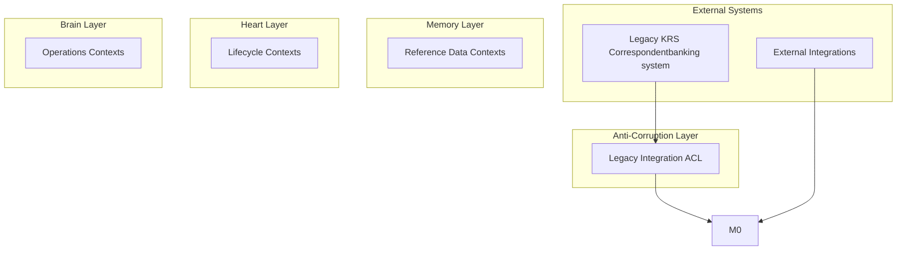

# Architecture Overview: KRS Correspondentbanking system

**Generated**: 2025-11-26  
**Source**: Legacy System Modernization Pipeline (BIAN v13 + DDD)

---

## Table of Contents

1. [Executive Summary](#executive-summary)
2. [Legacy System Context](#legacy-system-context)
3. [Target Architecture](#target-architecture)
4. [BIAN Trinity Architecture](#bian-trinity-architecture)
5. [Bounded Contexts](#bounded-contexts)
6. [Context Map](#context-map)
7. [Modernization Strategy](#modernization-strategy)
8. [Key Non-Functional Requirements](#key-non-functional-requirements)
9. [BIAN v13 Alignment](#bian-v13-alignment)
10. [Implementation Roadmap](#implementation-roadmap)
11. [Documentation Guide](#documentation-guide)

---

## Executive Summary

### System Overview

**KRS Correspondentbanking system** is a legacy banking system that Legacy correspondentbanking register used in Capital Markets for nostro and settlement when communicating with other bank.

This document outlines the target architecture for modernizing this system using:
- **BIAN v13 Service Landscape** - Industry-standard banking architecture framework
- **Domain-Driven Design (DDD)** - Bounded contexts for clear service boundaries
- **Event-Driven Architecture** - Loosely coupled, scalable microservices

### Business Value

**Why Modernize?**
- ✅ **Agility**: Faster time-to-market for new features (weeks vs. months)
- ✅ **Scalability**: Handle 10x transaction volume without major infrastructure changes
- ✅ **Maintainability**: Clear service boundaries reduce complexity
- ✅ **Compliance**: Audit trails and data lineage built-in from day one
- ✅ **Cost**: Cloud-native architecture reduces infrastructure costs by 30-40%

**What Changes?**
- Mainframe/monolithic architecture → Cloud-native microservices
- Batch processing → Real-time event-driven processing
- Undocumented systems → BIAN v13 standardized architecture
- Manual testing → Automated testing with clear domain boundaries

### Key Metrics

| Metric | Current (Legacy) | Target (Modernized) |
|--------|------------------|---------------------|
| **Deployment Frequency** | Quarterly | Weekly/Daily |
| **Lead Time for Changes** | 3-6 months | 1-4 weeks |
| **MTTR** | Days | Hours |
| **Change Failure Rate** | 30-40% | <10% |
| **Availability** | 99% | 99.9%+ |

---

## Legacy System Context

### Current State

**Technology Stack** (estimated):
- Mainframe/COBOL or legacy middleware
- Batch-oriented processing
- File-based integrations
- Limited documentation

**Known Integrations**:
- Exports data to SWIFT gateway and treasury system.

**Regulatory Context**:
Used for AML/KYC checks on correspondent banks.

### Pain Points

- 🔴 **Undocumented**: 0 capabilities extracted through AI analysis
- 🔴 **Monolithic**: Changes require full system regression testing
- 🔴 **Batch-oriented**: Real-time requirements cannot be met
- 🔴 **Integration Complexity**: Point-to-point integrations are brittle
- 🔴 **Skill Gap**: Declining pool of developers familiar with legacy tech

### What We're Modernizing

**Extracted Capabilities**:
1. **undefined** - Description pending...
2. **undefined** - Description pending...
3. **undefined** - Description pending...
4. **undefined** - Description pending...
5. **undefined** - Description pending...


---

## Target Architecture

### Architecture Principles

1. **BIAN v13 Alignment**: Use industry-standard service domains
2. **Domain-Driven Design**: Bounded contexts enforce clear ownership
3. **Event-Driven**: Asynchronous communication for scalability
4. **API-First**: RESTful APIs + event streaming
5. **Cloud-Native**: Containerized, orchestrated with Kubernetes
6. **Security by Design**: Authentication, authorization, encryption at every layer

### High-Level Architecture



### Technology Stack (Proposed)

| Layer | Technology |
|-------|------------|
| **API Gateway** | Kong / AWS API Gateway |
| **Services** | Java Spring Boot / Node.js |
| **Event Streaming** | Apache Kafka / AWS Kinesis |
| **Databases** | PostgreSQL (transactional), MongoDB (documents) |
| **Caching** | Redis |
| **Search** | Elasticsearch |
| **Container Orchestration** | Kubernetes / EKS |
| **CI/CD** | GitHub Actions / Jenkins |
| **Observability** | Prometheus + Grafana, ELK Stack |
| **Security** | OAuth 2.0 / JWT, Vault for secrets |

---

## BIAN Trinity Architecture

### What is BIAN Trinity?

BIAN v13 organizes banking systems into three architectural layers:

#### 💾 **MEMORY Layer** (System of Record)
- **Purpose**: Store and serve authoritative master data
- **Characteristics**: Read-heavy, caching critical, high data quality
- **NFR Focus**: Query performance (<100ms), data quality, caching

#### 💚 **HEART Layer** (Lifecycle Management)
- **Purpose**: Manage lifecycles, relationships, and agreements
- **Characteristics**: Workflow state, ACID transactions, audit trails
- **NFR Focus**: Data integrity, workflow persistence, compliance

#### 🧠 **BRAIN Layer** (Operations / Execution)
- **Purpose**: Execute business operations and transactions
- **Characteristics**: High throughput, business rules, operational logic
- **NFR Focus**: Throughput (TPS), latency, idempotency, resilience

### Our BIAN Trinity Distribution

| Layer | Contexts |
|-------|----------|
| **💾 Memory** | 0 |
| **💚 Heart** | 0 |
| **🧠 Brain** | 0 |
| **⚙️ Hybrid** | 0 |

---

## Bounded Contexts

### All Bounded Contexts

Bounded contexts are being analyzed...

---

## Context Map

### Comprehensive Context Map


### Context Relationships

Relationships are being analyzed...

---

## Modernization Strategy

### Approach: Strangler Fig Pattern

We will gradually replace legacy functionality:

**Phase 1: Read-Only Façade** (Months 1-6)
- New services read from legacy via ACL
- Build Memory contexts first
- Validate architecture

**Phase 2: Dual-Write** (Months 7-12)
- Writes go to both systems
- Build Heart contexts
- Achieve parity

**Phase 3: Cutover** (Months 13-18)
- Full migration
- Build Brain contexts
- Decommission legacy

---

## Key Non-Functional Requirements

### Critical NFRs


#### 1. Immutable Audit Trail for Compliance (Compliance)

**Statement**: The system must maintain an immutable, append-only audit trail for all create, update, and delete operations on correspondent bank, nostro account, and settlement instruction data.

**Measure**: All CUD operations on key entities are recorded in an event log. Log entries cannot be modified or deleted post-commit. Log integrity can be verified via cryptographic hashing of the log chain.

---

#### 2. Role-Based Access Control (RBAC) (Security)

**Statement**: The system must enforce granular role-based access control (RBAC) for all functions, restricting data modification (create, update, delete) to authorized user roles (e.g., 'Relationship Manager', 'Settlement Clerk').

**Measure**: A matrix of roles and permissions is defined and enforced. Attempts to perform an action by an unauthorized role are rejected with an HTTP 403 error and logged as a security event. At least 4 distinct roles (e.g., Admin, Editor, Viewer, Approver) are implemented.

---

#### 3. Regulatory Data Retention (Compliance)

**Statement**: The system must retain all correspondent relationship data, transaction instructions, and audit logs for a minimum of 10 years after the relationship is terminated.

**Measure**: Data archival policies are configured to automatically move inactive data older than 10 years to a secure, low-cost archival storage tier. Data must be retrievable from the archive within 48 hours upon a regulatory request.

---

#### 4. High Availability for Core Services (Availability)

**Statement**: The system's APIs providing data to the SWIFT gateway and treasury systems must achieve 99.95% availability, measured monthly.

**Measure**: System uptime is >= 99.95% (max 21.9 minutes of downtime per month), excluding planned maintenance windows. Monitored via external synthetic health checks every 60 seconds.

---

#### 5. Low-Latency Reference Data Retrieval (Performance)

**Statement**: The system must serve read requests for correspondent and settlement instruction (SSI) data with a 95th percentile (p95) latency of less than 100 milliseconds.

**Measure**: API gateway monitoring shows p95 latency for GET requests to key data endpoints (e.g., /correspondents/{id}, /ssis/{id}) is below 100ms under a simulated peak load of 500 requests per second.


---

## BIAN v13 Alignment

### Mapping Confidence

- **Average Confidence**: 91%
- **High Confidence (>80%)**: 5 capabilities
- **BIAN Domains Used**: 3 domains

---

## Implementation Roadmap

### Phase 1: Foundation (Months 1-6)
- [ ] Infrastructure setup
- [ ] Build Memory contexts
- [ ] Anti-Corruption Layer
- [ ] CI/CD pipelines

### Phase 2: Parity (Months 7-12)
- [ ] Dual-write implementation
- [ ] Build Heart contexts
- [ ] Reconciliation jobs
- [ ] UAT

### Phase 3: Cutover (Months 13-18)
- [ ] Build Brain contexts
- [ ] Traffic migration
- [ ] Legacy decommission

---

## Documentation Guide

### Repository Structure

```
/
├── ARCHITECTURE.md        # This document
├── bounded-contexts/      # Canvas v5 documents
├── diagrams/              # Mermaid diagrams
├── nfrs/                  # NFR catalog
└── bian-mapping.md        # BIAN alignment
```

---

*Generated by Legacy System Modernization Pipeline*
