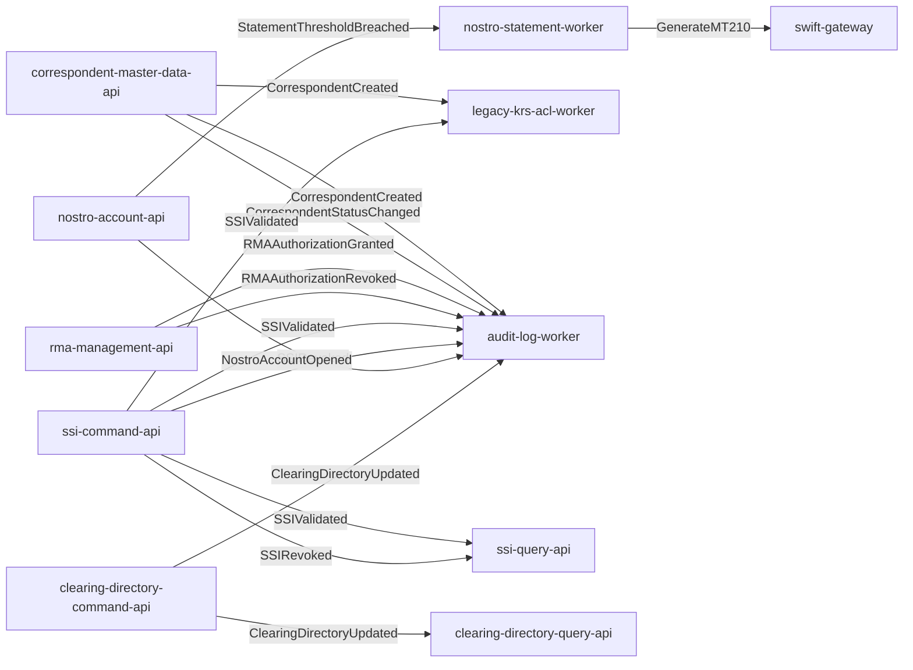

# Event Catalog: KRS Correspondentbanking system

**Generated:** 2025-11-26  
**Total Events:** 10  
**Total Topics:** 7  
**Total Consumers:** 15

---

## Table of Contents

1. [Overview](#overview)
2. [Event Summary](#event-summary)
3. [Events by Type](#events-by-type)
4. [Events by Bounded Context](#events-by-bounded-context)
5. [Kafka Topics](#kafka-topics)
6. [Event Flows](#event-flows)
7. [Consumer Catalog](#consumer-catalog)
8. [CloudEvents Specification](#cloudevents-specification)
9. [Avro Schemas](#avro-schemas)
10. [Event Sourcing](#event-sourcing)
11. [Testing Events](#testing-events)

---

## Overview

This document catalogs all domain events in the modernized KRS Correspondentbanking system system. Events enable asynchronous, loosely-coupled communication between microservices using:

- **CloudEvents 1.0** standard format
- **Apache Kafka** as message broker
- **Avro schemas** for serialization
- **Event-driven architecture** patterns
- **At-least-once delivery** guarantees
- **Idempotent consumers** for reliability

### Event-Driven Architecture Benefits

- ✅ **Loose Coupling:** Services don't need to know about each other
- ✅ **Scalability:** Process events asynchronously, scale independently
- ✅ **Resilience:** Services can be down temporarily, events are not lost
- ✅ **Audit Trail:** Events provide natural audit log
- ✅ **Event Sourcing:** Rebuild state from event history

---

## Event Summary

### By Category

| Category | Count | Description |
|----------|-------|-------------|
| **domain-event** | 9 | Internal domain state changes |
| **command-event** | 1 | System/technical events |
| **integration-event** | 0 | Cross-context notifications |
| **system-event** | 0 | System/technical events |

### By Bounded Context

- **Correspondent Relationship Management**: 4 events
- **Settlement Instructions Management**: 2 events
- **Nostro Account Management**: 3 events
- **Clearing System Directory**: 1 events

### Overall Statistics

- **Total Events:** 10
- **Total Event Flows:** 15
- **Average Consumers per Event:** 1.5
- **Most Consumed Event:** SSIValidated (3 consumers)

---

## Events by Type

### 1. CorrespondentCreated

**Event Type:** `com.bank.correspondent.relationship.CorrespondentCreated`  
**Publisher:** correspondent-master-data-api  
**Bounded Context:** Correspondent Relationship Management  
**Category:** domain-event  
**Topic:** `correspondent.masterdata.events`  
**Consumers:** 2

**Description:** Published when a new correspondent bank is successfully created and onboarded.

#### CloudEvents Format

```json
{
  "specversion": "1.0",
  "type": "com.bank.correspondent.relationship.CorrespondentCreated",
  "source": "/microservices/correspondent-master-data-api",
  "subject": "correspondent/{correspondent_id}",
  "id": "uuid",
  "time": "2024-11-27T10:30:00Z",
  "datacontenttype": "application/json"
}
```

#### Example Payload

```json
{
  "specversion": "1.0",
  "type": "com.bank.correspondent.relationship.CorrespondentCreated",
  "source": "/microservices/correspondent-master-data-api",
  "id": "a7b3c9d1-e5f7-4a9b-8c1d-2e3f4a5b6c7d",
  "time": "2024-10-21T09:15:30Z",
  "subject": "correspondent/f47ac10b-58cc-4372-a567-0e02b2c3d479",
  "datacontenttype": "application/json",
  "data": {
    "correspondent_id": "f47ac10b-58cc-4372-a567-0e02b2c3d479",
    "bic": "NEDSZAJJ",
    "lei": "549300Y1L942BC237A40",
    "legal_name": "Nedbank Limited",
    "country_code": "ZA",
    "status": "ACTIVE",
    "created_at": 1729502130000,
    "created_by": "user-onboarding-svc",
    "aggregate_version": 1
  }
}
```

#### Consumers

- **legacy-krs-acl-worker** (`acl-krs-correspondent-sync`): Translate and INSERT into legacy KRSTB103 table.
- **audit-log-worker** (`audit-log-writer`): Persist event to immutable audit log for compliance.

#### Avro Schema


**Namespace:** `com.bank.correspondent.relationship.events.v1`  
**Fields:** 9

```json
{
  "type": "record",
  "name": "CorrespondentCreated",
  "namespace": "com.bank.correspondent.relationship.events.v1",
  "doc": "Event published when a new correspondent bank is created.",
  "fields": [
    {
      "name": "correspondent_id",
      "type": {
        "type": "string",
        "logicalType": "uuid"
      },
      "doc": "Unique identifier for the correspondent bank aggregate."
    },
    {
      "name": "bic",
      "type": "string",
      "doc": "Bank Identifier Code (ISO 9362) of the correspondent."
    },
    {
      "name": "lei",
      "type": [
        "null",
        "string"
      ],
      "doc": "Legal Entity Identifier (ISO 17442), optional.",
      "default": null
    },
    {
      "name": "legal_name",
      "type": "string",
      "doc": "Full legal name of the correspondent bank."
    },
    {
      "name": "country_code",
      "type": "string",
      "doc": "ISO 3166-1 alpha-2 country code."
    },
    {
      "name": "status",
      "type": {
        "type": "enum",
        "name": "CorrespondentStatus",
        "symbols": [
          "ACTIVE",
          "SUSPENDED",
          "PENDING_APPROVAL",
          "TERMINATED"
        ]
      },
      "doc": "Initial status of the correspondent, typically ACTIVE.",
      "default": "ACTIVE"
    },
    {
      "name": "created_at",
      "type": {
        "type": "long",
        "logicalType": "timestamp-millis"
      },
      "doc": "Timestamp of when the correspondent was created."
    },
    {
      "name": "created_by",
      "type": "string",
      "doc": "Identifier of the user or system that initiated the creation."
    },
    {
      "name": "aggregate_version",
      "type": "int",
      "doc": "The version of the aggregate after this event. Should be 1.",
      "default": 1
    }
  ]
}
```


---

### 2. CorrespondentStatusChanged

**Event Type:** `com.bank.correspondent.relationship.CorrespondentStatusChanged`  
**Publisher:** correspondent-master-data-api  
**Bounded Context:** Correspondent Relationship Management  
**Category:** domain-event  
**Topic:** `correspondent.masterdata.events`  
**Consumers:** 1

**Description:** Published when the operational status of a correspondent relationship changes (e.g., Active to Suspended).

#### CloudEvents Format

```json
{
  "specversion": "1.0",
  "type": "com.bank.correspondent.relationship.CorrespondentStatusChanged",
  "source": "/microservices/correspondent-master-data-api",
  "subject": "correspondent/{correspondent_id}",
  "id": "uuid",
  "time": "2024-11-27T10:30:00Z",
  "datacontenttype": "application/json"
}
```

#### Example Payload

```json
{
  "specversion": "1.0",
  "type": "com.bank.correspondent.relationship.CorrespondentStatusChanged",
  "source": "/microservices/correspondent-master-data-api",
  "id": "b8c4d0e2-f6a8-4b0c-9d2e-3f4a5b6c7d8e",
  "time": "2024-11-05T14:00:15Z",
  "subject": "correspondent/f47ac10b-58cc-4372-a567-0e02b2c3d479",
  "datacontenttype": "application/json",
  "data": {
    "correspondent_id": "f47ac10b-58cc-4372-a567-0e02b2c3d479",
    "previous_status": "ACTIVE",
    "new_status": "SUSPENDED",
    "reason_text": "Compliance review required.",
    "changed_at": 1730815215000,
    "changed_by": "compliance-officer-01",
    "aggregate_version": 2
  }
}
```

#### Consumers

- **audit-log-worker** (`audit-log-writer`): Persist event to immutable audit log for compliance.

#### Avro Schema


**Namespace:** `com.bank.correspondent.relationship.events.v1`  
**Fields:** 7

```json
{
  "type": "record",
  "name": "CorrespondentStatusChanged",
  "namespace": "com.bank.correspondent.relationship.events.v1",
  "doc": "Event published when a correspondent's status is updated.",
  "fields": [
    {
      "name": "correspondent_id",
      "type": {
        "type": "string",
        "logicalType": "uuid"
      },
      "doc": "Unique identifier for the correspondent bank aggregate."
    },
    {
      "name": "previous_status",
      "type": "com.bank.correspondent.relationship.events.v1.CorrespondentStatus",
      "doc": "The status of the correspondent before the change."
    },
    {
      "name": "new_status",
      "type": "com.bank.correspondent.relationship.events.v1.CorrespondentStatus",
      "doc": "The new status of the correspondent."
    },
    {
      "name": "reason_text",
      "type": [
        "null",
        "string"
      ],
      "doc": "Optional free-text reason for the status change.",
      "default": null
    },
    {
      "name": "changed_at",
      "type": {
        "type": "long",
        "logicalType": "timestamp-millis"
      },
      "doc": "Timestamp of when the status change occurred."
    },
    {
      "name": "changed_by",
      "type": "string",
      "doc": "Identifier of the user or system that initiated the change."
    },
    {
      "name": "aggregate_version",
      "type": "int",
      "doc": "The version of the aggregate after this event."
    }
  ]
}
```


---

### 3. RMAAuthorizationGranted

**Event Type:** `com.bank.correspondent.relationship.RMAAuthorizationGranted`  
**Publisher:** rma-management-api  
**Bounded Context:** Correspondent Relationship Management  
**Category:** domain-event  
**Topic:** `correspondent.rma.events`  
**Consumers:** 1

**Description:** Published when a SWIFT RMA authorization is granted, permitting a specific message type to be exchanged.

#### CloudEvents Format

```json
{
  "specversion": "1.0",
  "type": "com.bank.correspondent.relationship.RMAAuthorizationGranted",
  "source": "/microservices/rma-management-api",
  "subject": "rma-agreement/{agreement_id}",
  "id": "uuid",
  "time": "2024-11-27T10:30:00Z",
  "datacontenttype": "application/json"
}
```

#### Example Payload

```json
{
  "specversion": "1.0",
  "type": "com.bank.correspondent.relationship.RMAAuthorizationGranted",
  "source": "/microservices/rma-management-api",
  "id": "c9d0e1f2-a7b8-4c1d-9e2f-3a4b5c6d7e8f",
  "time": "2024-11-10T11:20:00Z",
  "subject": "rma-agreement/e3f4a5b6-c7d8-4e9f-a0b1-c2d3e4f5a6b7",
  "datacontenttype": "application/json",
  "data": {
    "agreement_id": "e3f4a5b6-c7d8-4e9f-a0b1-c2d3e4f5a6b7",
    "correspondent_bic": "NEDSZAJJ",
    "message_type": "pacs.008.001.08",
    "direction": "RECEIVE",
    "granted_at": 1731237600000,
    "granted_by": "swift-admin-02"
  }
}
```

#### Consumers

- **audit-log-worker** (`audit-log-writer`): Persist event to immutable audit log for compliance.

#### Avro Schema


**Namespace:** `com.bank.correspondent.relationship.events.v1`  
**Fields:** 6

```json
{
  "type": "record",
  "name": "RMAAuthorizationGranted",
  "namespace": "com.bank.correspondent.relationship.events.v1",
  "doc": "Event for a new SWIFT RMA authorization.",
  "fields": [
    {
      "name": "agreement_id",
      "type": {
        "type": "string",
        "logicalType": "uuid"
      },
      "doc": "Unique identifier for the RMA agreement record."
    },
    {
      "name": "correspondent_bic",
      "type": "string",
      "doc": "BIC of the correspondent for whom the authorization is granted."
    },
    {
      "name": "message_type",
      "type": "string",
      "doc": "The SWIFT message type (e.g., 'pacs.008.001.08', 'MT103')."
    },
    {
      "name": "direction",
      "type": {
        "type": "enum",
        "name": "RMADirection",
        "symbols": [
          "SEND",
          "RECEIVE"
        ]
      },
      "doc": "Direction of the message flow (SEND or RECEIVE)."
    },
    {
      "name": "granted_at",
      "type": {
        "type": "long",
        "logicalType": "timestamp-millis"
      },
      "doc": "Timestamp of when the authorization was granted."
    },
    {
      "name": "granted_by",
      "type": "string",
      "doc": "Identifier of the user or system that granted the authorization."
    }
  ]
}
```


---

### 4. RMAAuthorizationRevoked

**Event Type:** `com.bank.correspondent.relationship.RMAAuthorizationRevoked`  
**Publisher:** rma-management-api  
**Bounded Context:** Correspondent Relationship Management  
**Category:** domain-event  
**Topic:** `correspondent.rma.events`  
**Consumers:** 1

**Description:** Published when a SWIFT RMA authorization is revoked, prohibiting a specific message type from being exchanged.

#### CloudEvents Format

```json
{
  "specversion": "1.0",
  "type": "com.bank.correspondent.relationship.RMAAuthorizationRevoked",
  "source": "/microservices/rma-management-api",
  "subject": "rma-agreement/{agreement_id}",
  "id": "uuid",
  "time": "2024-11-27T10:30:00Z",
  "datacontenttype": "application/json"
}
```

#### Example Payload

```json
{
  "specversion": "1.0",
  "type": "com.bank.correspondent.relationship.RMAAuthorizationRevoked",
  "source": "/microservices/rma-management-api",
  "id": "d0e1f2a3-b8c9-4d1e-9f2a-3b4c5d6e7f8a",
  "time": "2024-12-01T16:45:10Z",
  "subject": "rma-agreement/e3f4a5b6-c7d8-4e9f-a0b1-c2d3e4f5a6b7",
  "datacontenttype": "application/json",
  "data": {
    "agreement_id": "e3f4a5b6-c7d8-4e9f-a0b1-c2d3e4f5a6b7",
    "correspondent_bic": "NEDSZAJJ",
    "message_type": "pacs.008.001.08",
    "direction": "RECEIVE",
    "revoked_at": 1733071510000,
    "revoked_by": "swift-admin-02"
  }
}
```

#### Consumers

- **audit-log-worker** (`audit-log-writer`): Persist event to immutable audit log for compliance.

#### Avro Schema


**Namespace:** `com.bank.correspondent.relationship.events.v1`  
**Fields:** 6

```json
{
  "type": "record",
  "name": "RMAAuthorizationRevoked",
  "namespace": "com.bank.correspondent.relationship.events.v1",
  "doc": "Event for a revoked SWIFT RMA authorization.",
  "fields": [
    {
      "name": "agreement_id",
      "type": {
        "type": "string",
        "logicalType": "uuid"
      },
      "doc": "Unique identifier for the RMA agreement record."
    },
    {
      "name": "correspondent_bic",
      "type": "string",
      "doc": "BIC of the correspondent for whom the authorization is revoked."
    },
    {
      "name": "message_type",
      "type": "string",
      "doc": "The SWIFT message type (e.g., 'pacs.008.001.08', 'MT103')."
    },
    {
      "name": "direction",
      "type": "com.bank.correspondent.relationship.events.v1.RMADirection",
      "doc": "Direction of the message flow (SEND or RECEIVE)."
    },
    {
      "name": "revoked_at",
      "type": {
        "type": "long",
        "logicalType": "timestamp-millis"
      },
      "doc": "Timestamp of when the authorization was revoked."
    },
    {
      "name": "revoked_by",
      "type": "string",
      "doc": "Identifier of the user or system that revoked the authorization."
    }
  ]
}
```


---

### 5. SSIValidated

**Event Type:** `com.bank.settlement.instructions.SSIValidated`  
**Publisher:** ssi-command-api  
**Bounded Context:** Settlement Instructions Management  
**Category:** domain-event  
**Topic:** `settlement.ssi.events`  
**Consumers:** 3

**Description:** Announces a new or updated Standard Settlement Instruction (SSI) is valid and ready for use.

#### CloudEvents Format

```json
{
  "specversion": "1.0",
  "type": "com.bank.settlement.instructions.SSIValidated",
  "source": "/microservices/ssi-command-api",
  "subject": "ssi/{ssi_id}",
  "id": "uuid",
  "time": "2024-11-27T10:30:00Z",
  "datacontenttype": "application/json"
}
```

#### Example Payload

```json
{
  "specversion": "1.0",
  "type": "com.bank.settlement.instructions.SSIValidated",
  "source": "/microservices/ssi-command-api",
  "id": "e1f2a3b4-c8d9-4e1f-9a2b-3c4d5e6f7a8b",
  "time": "2024-11-12T10:05:00Z",
  "subject": "ssi/d5e6f7a8-b9c0-4d1e-8f2a-3b4c5d6e7f8a",
  "datacontenttype": "application/json",
  "data": {
    "ssi_id": "d5e6f7a8-b9c0-4d1e-8f2a-3b4c5d6e7f8a",
    "counterparty_id": "f47ac10b-58cc-4372-a567-0e02b2c3d479",
    "currency": "USD",
    "product_type": "FX",
    "routing_path": {
      "beneficiary_bank": {
        "bic": "NEDSZAJJ",
        "account_number": "123456789",
        "name_and_address": [
          "Nedbank Limited",
          "135 Rivonia Road",
          "Sandton, 2196",
          "South Africa"
        ]
      },
      "intermediary_banks": [
        {
          "bic": "IRVTUS3N",
          "account_number": null,
          "name_and_address": []
        }
      ]
    },
    "effective_from": 1731373200000,
    "validated_at": 1731398700000,
    "validated_by": "settlement-clerk-05",
    "aggregate_version": 1
  }
}
```

#### Consumers

- **ssi-query-api** (`ssi-query-model-builder`): Create/update the read model and populate the cache.
- **legacy-krs-acl-worker** (`acl-krs-ssi-sync`): Translate and INSERT/UPDATE into legacy KRSTB045 table.
- **audit-log-worker** (`audit-log-writer`): Persist event to immutable audit log for compliance.

#### Avro Schema


**Namespace:** `com.bank.settlement.instructions.events.v1`  
**Fields:** 9

```json
{
  "type": "record",
  "name": "SSIValidated",
  "namespace": "com.bank.settlement.instructions.events.v1",
  "doc": "Event for a validated Standard Settlement Instruction.",
  "fields": [
    {
      "name": "ssi_id",
      "type": {
        "type": "string",
        "logicalType": "uuid"
      },
      "doc": "Unique identifier for the SSI."
    },
    {
      "name": "counterparty_id",
      "type": {
        "type": "string",
        "logicalType": "uuid"
      },
      "doc": "Identifier of the counterparty this SSI belongs to."
    },
    {
      "name": "currency",
      "type": "string",
      "doc": "ISO 4217 currency code."
    },
    {
      "name": "product_type",
      "type": "string",
      "doc": "The financial product this SSI applies to (e.g., 'FX', 'MM', 'SECURITIES')."
    },
    {
      "name": "routing_path",
      "type": {
        "type": "record",
        "name": "RoutingPath",
        "fields": [
          {
            "name": "beneficiary_bank",
            "type": {
              "type": "record",
              "name": "BankInstruction",
              "fields": [
                {
                  "name": "bic",
                  "type": "string"
                },
                {
                  "name": "account_number",
                  "type": [
                    "null",
                    "string"
                  ],
                  "default": null
                },
                {
                  "name": "name_and_address",
                  "type": {
                    "type": "array",
                    "items": "string"
                  },
                  "default": []
                }
              ]
            }
          },
          {
            "name": "intermediary_banks",
            "type": {
              "type": "array",
              "items": "BankInstruction"
            },
            "doc": "Ordered list of intermediary banks.",
            "default": []
          }
        ]
      }
    },
    {
      "name": "effective_from",
      "type": {
        "type": "long",
        "logicalType": "timestamp-millis"
      },
      "doc": "Timestamp from which this SSI is effective."
    },
    {
      "name": "validated_at",
      "type": {
        "type": "long",
        "logicalType": "timestamp-millis"
      },
      "doc": "Timestamp of when the SSI was validated."
    },
    {
      "name": "validated_by",
      "type": "string",
      "doc": "Identifier of the user or system that validated the SSI."
    },
    {
      "name": "aggregate_version",
      "type": "int",
      "doc": "The version of the SSI aggregate after this event."
    }
  ]
}
```


---

### 6. SSIRevoked

**Event Type:** `com.bank.settlement.instructions.SSIRevoked`  
**Publisher:** ssi-command-api  
**Bounded Context:** Settlement Instructions Management  
**Category:** domain-event  
**Topic:** `settlement.ssi.events`  
**Consumers:** 2

**Description:** Announces an SSI has been deactivated and should no longer be used.

#### CloudEvents Format

```json
{
  "specversion": "1.0",
  "type": "com.bank.settlement.instructions.SSIRevoked",
  "source": "/microservices/ssi-command-api",
  "subject": "ssi/{ssi_id}",
  "id": "uuid",
  "time": "2024-11-27T10:30:00Z",
  "datacontenttype": "application/json"
}
```

#### Example Payload

```json
{
  "specversion": "1.0",
  "type": "com.bank.settlement.instructions.SSIRevoked",
  "source": "/microservices/ssi-command-api",
  "id": "f2a3b4c5-d8e9-4f1a-9b2c-3d4e5f6a7b8c",
  "time": "2025-01-15T18:30:00Z",
  "subject": "ssi/d5e6f7a8-b9c0-4d1e-8f2a-3b4c5d6e7f8a",
  "datacontenttype": "application/json",
  "data": {
    "ssi_id": "d5e6f7a8-b9c0-4d1e-8f2a-3b4c5d6e7f8a",
    "reason_text": "Counterparty provided new instructions.",
    "revoked_at": 1736994600000,
    "revoked_by": "settlement-clerk-05",
    "aggregate_version": 2
  }
}
```

#### Consumers

- **ssi-query-api** (`ssi-query-model-builder`): Mark the SSI as inactive in the read model and invalidate cache.
- **audit-log-worker** (`audit-log-writer`): Persist event to immutable audit log for compliance.

#### Avro Schema


**Namespace:** `com.bank.settlement.instructions.events.v1`  
**Fields:** 5

```json
{
  "type": "record",
  "name": "SSIRevoked",
  "namespace": "com.bank.settlement.instructions.events.v1",
  "doc": "Event for a revoked Standard Settlement Instruction.",
  "fields": [
    {
      "name": "ssi_id",
      "type": {
        "type": "string",
        "logicalType": "uuid"
      },
      "doc": "Unique identifier for the SSI."
    },
    {
      "name": "reason_text",
      "type": "string",
      "doc": "Reason for the revocation."
    },
    {
      "name": "revoked_at",
      "type": {
        "type": "long",
        "logicalType": "timestamp-millis"
      },
      "doc": "Timestamp of when the SSI was revoked."
    },
    {
      "name": "revoked_by",
      "type": "string",
      "doc": "Identifier of the user or system that revoked the SSI."
    },
    {
      "name": "aggregate_version",
      "type": "int",
      "doc": "The version of the SSI aggregate after this event."
    }
  ]
}
```


---

### 7. NostroAccountOpened

**Event Type:** `com.bank.nostro.account.NostroAccountOpened`  
**Publisher:** nostro-account-api  
**Bounded Context:** Nostro Account Management  
**Category:** domain-event  
**Topic:** `correspondent.nostro.events`  
**Consumers:** 1

**Description:** Announces the creation of a new nostro account.

#### CloudEvents Format

```json
{
  "specversion": "1.0",
  "type": "com.bank.nostro.account.NostroAccountOpened",
  "source": "/microservices/nostro-account-api",
  "subject": "nostro-account/{account_id}",
  "id": "uuid",
  "time": "2024-11-27T10:30:00Z",
  "datacontenttype": "application/json"
}
```

#### Example Payload

```json
{
  "specversion": "1.0",
  "type": "com.bank.nostro.account.NostroAccountOpened",
  "source": "/microservices/nostro-account-api",
  "id": "a3b4c5d6-e8f9-4a1b-9c2d-3e4f5a6b7c8d",
  "time": "2024-11-18T09:00:00Z",
  "subject": "nostro-account/c5d6e7f8-a9b0-4c1d-8f2a-3b4c5d6e7f8a",
  "datacontenttype": "application/json",
  "data": {
    "account_id": "c5d6e7f8-a9b0-4c1d-8f2a-3b4c5d6e7f8a",
    "account_number": "987654321",
    "currency": "USD",
    "correspondent_bic": "IRVTUS3N",
    "opened_at": 1731920400000,
    "opened_by": "treasury-ops-01"
  }
}
```

#### Consumers

- **audit-log-worker** (`audit-log-writer`): Persist event to immutable audit log for compliance.

#### Avro Schema


**Namespace:** `com.bank.nostro.account.events.v1`  
**Fields:** 6

```json
{
  "type": "record",
  "name": "NostroAccountOpened",
  "namespace": "com.bank.nostro.account.events.v1",
  "doc": "Event for a newly opened nostro account.",
  "fields": [
    {
      "name": "account_id",
      "type": {
        "type": "string",
        "logicalType": "uuid"
      },
      "doc": "Unique identifier for the nostro account."
    },
    {
      "name": "account_number",
      "type": "string",
      "doc": "The account number assigned by the correspondent bank."
    },
    {
      "name": "currency",
      "type": "string",
      "doc": "ISO 4217 currency code of the account."
    },
    {
      "name": "correspondent_bic",
      "type": "string",
      "doc": "BIC of the correspondent bank where the account is held."
    },
    {
      "name": "opened_at",
      "type": {
        "type": "long",
        "logicalType": "timestamp-millis"
      },
      "doc": "Timestamp of when the account was opened."
    },
    {
      "name": "opened_by",
      "type": "string",
      "doc": "Identifier of the user or system that opened the account."
    }
  ]
}
```


---

### 8. StatementThresholdBreached

**Event Type:** `com.bank.nostro.account.StatementThresholdBreached`  
**Publisher:** nostro-account-api  
**Bounded Context:** Nostro Account Management  
**Category:** domain-event  
**Topic:** `correspondent.nostro.operations`  
**Consumers:** 1

**Description:** Signals that a nostro account balance has crossed a configured threshold, potentially triggering a statement generation.

#### CloudEvents Format

```json
{
  "specversion": "1.0",
  "type": "com.bank.nostro.account.StatementThresholdBreached",
  "source": "/microservices/nostro-account-api",
  "subject": "nostro-account/{account_id}",
  "id": "uuid",
  "time": "2024-11-27T10:30:00Z",
  "datacontenttype": "application/json"
}
```

#### Example Payload

```json
{
  "specversion": "1.0",
  "type": "com.bank.nostro.account.StatementThresholdBreached",
  "source": "/microservices/nostro-account-api",
  "id": "b4c5d6e7-f9a0-4b1c-9d2e-3f4a5b6c7d8e",
  "time": "2024-11-20T17:00:00Z",
  "subject": "nostro-account/c5d6e7f8-a9b0-4c1d-8f2a-3b4c5d6e7f8a",
  "datacontenttype": "application/json",
  "data": {
    "account_id": "c5d6e7f8-a9b0-4c1d-8f2a-3b4c5d6e7f8a",
    "current_balance": "1050234.56",
    "threshold_amount": "1000000.00",
    "currency": "USD",
    "breached_at": 1732122000000
  }
}
```

#### Consumers

- **nostro-statement-worker** (`nostro-statement-generator`): Trigger MT210 generation process.

#### Avro Schema


**Namespace:** `com.bank.nostro.account.events.v1`  
**Fields:** 5

```json
{
  "type": "record",
  "name": "StatementThresholdBreached",
  "namespace": "com.bank.nostro.account.events.v1",
  "doc": "Event for a nostro account balance crossing a statement threshold.",
  "fields": [
    {
      "name": "account_id",
      "type": {
        "type": "string",
        "logicalType": "uuid"
      },
      "doc": "Unique identifier for the nostro account."
    },
    {
      "name": "current_balance",
      "type": {
        "type": "bytes",
        "logicalType": "decimal",
        "precision": 18,
        "scale": 2
      },
      "doc": "The balance of the account at the time of breach."
    },
    {
      "name": "threshold_amount",
      "type": {
        "type": "bytes",
        "logicalType": "decimal",
        "precision": 18,
        "scale": 2
      },
      "doc": "The threshold amount that was breached."
    },
    {
      "name": "currency",
      "type": "string",
      "doc": "ISO 4217 currency code of the account."
    },
    {
      "name": "breached_at",
      "type": {
        "type": "long",
        "logicalType": "timestamp-millis"
      },
      "doc": "Timestamp of when the threshold was breached."
    }
  ]
}
```


---

### 9. GenerateMT210

**Event Type:** `com.bank.swift.outbound.GenerateMT210`  
**Publisher:** nostro-statement-worker  
**Bounded Context:** Nostro Account Management  
**Category:** command-event  
**Topic:** `swift.outbound.commands`  
**Consumers:** 1

**Description:** A command to the SWIFT Gateway to create and send an MT210 message.

#### CloudEvents Format

```json
{
  "specversion": "1.0",
  "type": "com.bank.swift.outbound.GenerateMT210",
  "source": "/microservices/nostro-statement-worker",
  "subject": "nostro-account/{account_id}",
  "id": "uuid",
  "time": "2024-11-27T10:30:00Z",
  "datacontenttype": "application/json"
}
```

#### Example Payload

```json
{
  "specversion": "1.0",
  "type": "com.bank.swift.outbound.GenerateMT210",
  "source": "/microservices/nostro-statement-worker",
  "id": "c5d6e7f8-a0b1-4c2d-9e3f-4a5b6c7d8e9f",
  "time": "2024-11-20T17:00:05Z",
  "subject": "nostro-account/c5d6e7f8-a9b0-4c1d-8f2a-3b4c5d6e7f8a",
  "datacontenttype": "application/json",
  "data": {
    "command_id": "d6e7f8a9-b0c1-4d2e-9f3a-4b5c6d7e8f9a",
    "account_id": "c5d6e7f8-a9b0-4c1d-8f2a-3b4c5d6e7f8a",
    "statement_date": 1732147200000,
    "final_closing_balance": "1050234.56",
    "currency": "USD"
  }
}
```

#### Consumers

- **swift-gateway** (`swift-gateway-mt210-processor`): Consume command to construct and send an MT210 message.

#### Avro Schema


**Namespace:** `com.bank.swift.outbound.commands.v1`  
**Fields:** 5

```json
{
  "type": "record",
  "name": "GenerateMT210",
  "namespace": "com.bank.swift.outbound.commands.v1",
  "doc": "Command to generate a SWIFT MT210 message.",
  "fields": [
    {
      "name": "command_id",
      "type": {
        "type": "string",
        "logicalType": "uuid"
      },
      "doc": "Unique identifier for this command instance."
    },
    {
      "name": "account_id",
      "type": {
        "type": "string",
        "logicalType": "uuid"
      },
      "doc": "The nostro account for which to generate the statement."
    },
    {
      "name": "statement_date",
      "type": {
        "type": "long",
        "logicalType": "timestamp-millis"
      },
      "doc": "The date for which the statement is being generated."
    },
    {
      "name": "final_closing_balance",
      "type": {
        "type": "bytes",
        "logicalType": "decimal",
        "precision": 18,
        "scale": 2
      },
      "doc": "The final closing balance to be reported in the MT210."
    },
    {
      "name": "currency",
      "type": "string",
      "doc": "ISO 4217 currency code of the balance."
    }
  ]
}
```


---

### 10. ClearingDirectoryUpdated

**Event Type:** `com.bank.clearing.directory.ClearingDirectoryUpdated`  
**Publisher:** clearing-directory-command-api  
**Bounded Context:** Clearing System Directory  
**Category:** domain-event  
**Topic:** `reference.clearing.events`  
**Consumers:** 2

**Description:** Signals that the entire clearing directory for a specific system has been updated.

#### CloudEvents Format

```json
{
  "specversion": "1.0",
  "type": "com.bank.clearing.directory.ClearingDirectoryUpdated",
  "source": "/microservices/clearing-directory-command-api",
  "subject": "clearing-system/{clearing_system_name}",
  "id": "uuid",
  "time": "2024-11-27T10:30:00Z",
  "datacontenttype": "application/json"
}
```

#### Example Payload

```json
{
  "specversion": "1.0",
  "type": "com.bank.clearing.directory.ClearingDirectoryUpdated",
  "source": "/microservices/clearing-directory-command-api",
  "id": "d7e8f9a0-b1c2-4d3e-9f4a-5b6c7d8e9f0a",
  "time": "2024-11-30T02:00:00Z",
  "subject": "clearing-system/TARGET2",
  "datacontenttype": "application/json",
  "data": {
    "update_id": "e8f9a0b1-c2d3-4e4f-a0b1-c2d3e4f5a6b7",
    "clearing_system_name": "TARGET2",
    "record_count": 55231,
    "updated_at": 1732932000000,
    "updated_by": "clearing-directory-sync-worker"
  }
}
```

#### Consumers

- **clearing-directory-query-api** (`clearing-directory-cache-invalidator`): Invalidate and refresh the entire cache for the specified clearing system.
- **audit-log-worker** (`audit-log-writer`): Persist event to immutable audit log for compliance.

#### Avro Schema


**Namespace:** `com.bank.clearing.directory.events.v1`  
**Fields:** 5

```json
{
  "type": "record",
  "name": "ClearingDirectoryUpdated",
  "namespace": "com.bank.clearing.directory.events.v1",
  "doc": "Event for a bulk update to a clearing system directory.",
  "fields": [
    {
      "name": "update_id",
      "type": {
        "type": "string",
        "logicalType": "uuid"
      },
      "doc": "Unique identifier for this update operation."
    },
    {
      "name": "clearing_system_name",
      "type": "string",
      "doc": "Name of the clearing system that was updated (e.g., 'TARGET2', 'FEDWIRE')."
    },
    {
      "name": "record_count",
      "type": "int",
      "doc": "The total number of participant records in the new directory."
    },
    {
      "name": "updated_at",
      "type": {
        "type": "long",
        "logicalType": "timestamp-millis"
      },
      "doc": "Timestamp of when the update was completed."
    },
    {
      "name": "updated_by",
      "type": "string",
      "doc": "Identifier of the user or system that performed the update."
    }
  ]
}
```


---


## Events by Bounded Context

### Correspondent Relationship Management

**Event Count:** 4

- **CorrespondentCreated** (`com.bank.correspondent.relationship.CorrespondentCreated`) - 2 consumers
- **CorrespondentStatusChanged** (`com.bank.correspondent.relationship.CorrespondentStatusChanged`) - 1 consumers
- **RMAAuthorizationGranted** (`com.bank.correspondent.relationship.RMAAuthorizationGranted`) - 1 consumers
- **RMAAuthorizationRevoked** (`com.bank.correspondent.relationship.RMAAuthorizationRevoked`) - 1 consumers

### Settlement Instructions Management

**Event Count:** 2

- **SSIValidated** (`com.bank.settlement.instructions.SSIValidated`) - 3 consumers
- **SSIRevoked** (`com.bank.settlement.instructions.SSIRevoked`) - 2 consumers

### Nostro Account Management

**Event Count:** 3

- **NostroAccountOpened** (`com.bank.nostro.account.NostroAccountOpened`) - 1 consumers
- **StatementThresholdBreached** (`com.bank.nostro.account.StatementThresholdBreached`) - 1 consumers
- **GenerateMT210** (`com.bank.swift.outbound.GenerateMT210`) - 1 consumers

### Clearing System Directory

**Event Count:** 1

- **ClearingDirectoryUpdated** (`com.bank.clearing.directory.ClearingDirectoryUpdated`) - 2 consumers


---

## Kafka Topics

### 1. correspondent.masterdata.events

**Description:** Domain events related to the lifecycle of Correspondent Bank entities.  
**Event Types:** 2  
**Partitions:** 6  
**Replication Factor:** 3  
**Retention:** 7 days  
**Cleanup Policy:** delete

#### Events on This Topic

- CorrespondentCreated
- CorrespondentStatusChanged

#### Statistics

- **Total Consumers:** 3
- **Messages/Day:** Estimated based on workload
- **Storage:** ~70 MB (assuming 10MB/day)


#### Configuration

```properties
topic.name=correspondent.masterdata.events
partitions=6
replication.factor=3
retention.ms=604800000
cleanup.policy=delete
compression.type=snappy
min.insync.replicas=2
```

---

### 2. correspondent.rma.events

**Description:** Domain events related to SWIFT RMA authorizations.  
**Event Types:** 2  
**Partitions:** 3  
**Replication Factor:** 3  
**Retention:** 7 days  
**Cleanup Policy:** delete

#### Events on This Topic

- RMAAuthorizationGranted
- RMAAuthorizationRevoked

#### Statistics

- **Total Consumers:** 2
- **Messages/Day:** Estimated based on workload
- **Storage:** ~70 MB (assuming 10MB/day)


#### Configuration

```properties
topic.name=correspondent.rma.events
partitions=3
replication.factor=3
retention.ms=604800000
cleanup.policy=delete
compression.type=snappy
min.insync.replicas=2
```

---

### 3. settlement.ssi.events

**Description:** Domain events for Standard Settlement Instructions (SSIs). Configured with infinite retention to support rebuilding read models.  
**Event Types:** 2  
**Partitions:** 6  
**Replication Factor:** 3  
**Retention:** 7 days  
**Cleanup Policy:** compact,delete

#### Events on This Topic

- SSIValidated
- SSIRevoked

#### Statistics

- **Total Consumers:** 5
- **Messages/Day:** Estimated based on workload
- **Storage:** ~0 MB (assuming 10MB/day)


#### Configuration

```properties
topic.name=settlement.ssi.events
partitions=6
replication.factor=3
retention.ms=-1
cleanup.policy=compact,delete
compression.type=snappy
min.insync.replicas=2
```

---

### 4. correspondent.nostro.events

**Description:** Domain events related to the lifecycle of Nostro accounts.  
**Event Types:** 1  
**Partitions:** 3  
**Replication Factor:** 3  
**Retention:** 7 days  
**Cleanup Policy:** delete

#### Events on This Topic

- NostroAccountOpened

#### Statistics

- **Total Consumers:** 1
- **Messages/Day:** Estimated based on workload
- **Storage:** ~70 MB (assuming 10MB/day)


#### Configuration

```properties
topic.name=correspondent.nostro.events
partitions=3
replication.factor=3
retention.ms=604800000
cleanup.policy=delete
compression.type=snappy
min.insync.replicas=2
```

---

### 5. correspondent.nostro.operations

**Description:** Operational events from the Nostro domain, such as threshold breaches.  
**Event Types:** 1  
**Partitions:** 3  
**Replication Factor:** 3  
**Retention:** 1 days  
**Cleanup Policy:** delete

#### Events on This Topic

- StatementThresholdBreached

#### Statistics

- **Total Consumers:** 1
- **Messages/Day:** Estimated based on workload
- **Storage:** ~10 MB (assuming 10MB/day)


#### Configuration

```properties
topic.name=correspondent.nostro.operations
partitions=3
replication.factor=3
retention.ms=86400000
cleanup.policy=delete
compression.type=snappy
min.insync.replicas=2
```

---

### 6. swift.outbound.commands

**Description:** Commands directed to the SWIFT Gateway for outbound message generation.  
**Event Types:** 1  
**Partitions:** 3  
**Replication Factor:** 3  
**Retention:** 1 days  
**Cleanup Policy:** delete

#### Events on This Topic

- GenerateMT210

#### Statistics

- **Total Consumers:** 1
- **Messages/Day:** Estimated based on workload
- **Storage:** ~10 MB (assuming 10MB/day)


#### Configuration

```properties
topic.name=swift.outbound.commands
partitions=3
replication.factor=3
retention.ms=86400000
cleanup.policy=delete
compression.type=snappy
min.insync.replicas=2
```

---

### 7. reference.clearing.events

**Description:** Events related to updates in the Clearing System Directory reference data.  
**Event Types:** 1  
**Partitions:** 1  
**Replication Factor:** 3  
**Retention:** 7 days  
**Cleanup Policy:** delete

#### Events on This Topic

- ClearingDirectoryUpdated

#### Statistics

- **Total Consumers:** 2
- **Messages/Day:** Estimated based on workload
- **Storage:** ~70 MB (assuming 10MB/day)


#### Configuration

```properties
topic.name=reference.clearing.events
partitions=1
replication.factor=3
retention.ms=604800000
cleanup.policy=delete
compression.type=snappy
min.insync.replicas=2
```

---


## Event Flows

Event flows between microservices:



### Flow Details

- **correspondent-master-data-api** → **legacy-krs-acl-worker** via `CorrespondentCreated` (topic: `correspondent.masterdata.events`)
- **correspondent-master-data-api** → **audit-log-worker** via `CorrespondentCreated` (topic: `correspondent.masterdata.events`)
- **correspondent-master-data-api** → **audit-log-worker** via `CorrespondentStatusChanged` (topic: `correspondent.masterdata.events`)
- **rma-management-api** → **audit-log-worker** via `RMAAuthorizationGranted` (topic: `correspondent.rma.events`)
- **rma-management-api** → **audit-log-worker** via `RMAAuthorizationRevoked` (topic: `correspondent.rma.events`)
- **ssi-command-api** → **ssi-query-api** via `SSIValidated` (topic: `settlement.ssi.events`)
- **ssi-command-api** → **legacy-krs-acl-worker** via `SSIValidated` (topic: `settlement.ssi.events`)
- **ssi-command-api** → **audit-log-worker** via `SSIValidated` (topic: `settlement.ssi.events`)
- **ssi-command-api** → **ssi-query-api** via `SSIRevoked` (topic: `settlement.ssi.events`)
- **ssi-command-api** → **audit-log-worker** via `SSIRevoked` (topic: `settlement.ssi.events`)
- **nostro-account-api** → **audit-log-worker** via `NostroAccountOpened` (topic: `correspondent.nostro.events`)
- **nostro-account-api** → **nostro-statement-worker** via `StatementThresholdBreached` (topic: `correspondent.nostro.operations`)
- **nostro-statement-worker** → **swift-gateway** via `GenerateMT210` (topic: `swift.outbound.commands`)
- **clearing-directory-command-api** → **clearing-directory-query-api** via `ClearingDirectoryUpdated` (topic: `reference.clearing.events`)
- **clearing-directory-command-api** → **audit-log-worker** via `ClearingDirectoryUpdated` (topic: `reference.clearing.events`)


---

## Consumer Catalog

Complete list of event consumers:

### legacy-krs-acl-worker → CorrespondentCreated

**Consumer Group:** `acl-krs-correspondent-sync`  
**Event Type:** `com.bank.correspondent.relationship.CorrespondentCreated`  
**Reason:** Translate and INSERT into legacy KRSTB103 table.  
**Processing:** at-least-once  
**Idempotency:** Check for existing record by BIC before INSERT.

---

### audit-log-worker → CorrespondentCreated

**Consumer Group:** `audit-log-writer`  
**Event Type:** `com.bank.correspondent.relationship.CorrespondentCreated`  
**Reason:** Persist event to immutable audit log for compliance.  
**Processing:** at-least-once  
**Idempotency:** Store event ID to detect and discard duplicates.

---

### audit-log-worker → CorrespondentStatusChanged

**Consumer Group:** `audit-log-writer`  
**Event Type:** `com.bank.correspondent.relationship.CorrespondentStatusChanged`  
**Reason:** Persist event to immutable audit log for compliance.  
**Processing:** at-least-once  
**Idempotency:** Store event ID to detect and discard duplicates.

---

### audit-log-worker → RMAAuthorizationGranted

**Consumer Group:** `audit-log-writer`  
**Event Type:** `com.bank.correspondent.relationship.RMAAuthorizationGranted`  
**Reason:** Persist event to immutable audit log for compliance.  
**Processing:** at-least-once  
**Idempotency:** Store event ID to detect and discard duplicates.

---

### audit-log-worker → RMAAuthorizationRevoked

**Consumer Group:** `audit-log-writer`  
**Event Type:** `com.bank.correspondent.relationship.RMAAuthorizationRevoked`  
**Reason:** Persist event to immutable audit log for compliance.  
**Processing:** at-least-once  
**Idempotency:** Store event ID to detect and discard duplicates.

---

### ssi-query-api → SSIValidated

**Consumer Group:** `ssi-query-model-builder`  
**Event Type:** `com.bank.settlement.instructions.SSIValidated`  
**Reason:** Create/update the read model and populate the cache.  
**Processing:** at-least-once  
**Idempotency:** Upsert based on ssi_id and check aggregate_version.

---

### legacy-krs-acl-worker → SSIValidated

**Consumer Group:** `acl-krs-ssi-sync`  
**Event Type:** `com.bank.settlement.instructions.SSIValidated`  
**Reason:** Translate and INSERT/UPDATE into legacy KRSTB045 table.  
**Processing:** at-least-once  
**Idempotency:** Upsert based on a composite key of counterparty, currency, and product.

---

### audit-log-worker → SSIValidated

**Consumer Group:** `audit-log-writer`  
**Event Type:** `com.bank.settlement.instructions.SSIValidated`  
**Reason:** Persist event to immutable audit log for compliance.  
**Processing:** at-least-once  
**Idempotency:** Store event ID to detect and discard duplicates.

---

### ssi-query-api → SSIRevoked

**Consumer Group:** `ssi-query-model-builder`  
**Event Type:** `com.bank.settlement.instructions.SSIRevoked`  
**Reason:** Mark the SSI as inactive in the read model and invalidate cache.  
**Processing:** at-least-once  
**Idempotency:** Update status based on ssi_id and check aggregate_version.

---

### audit-log-worker → SSIRevoked

**Consumer Group:** `audit-log-writer`  
**Event Type:** `com.bank.settlement.instructions.SSIRevoked`  
**Reason:** Persist event to immutable audit log for compliance.  
**Processing:** at-least-once  
**Idempotency:** Store event ID to detect and discard duplicates.

---

### audit-log-worker → NostroAccountOpened

**Consumer Group:** `audit-log-writer`  
**Event Type:** `com.bank.nostro.account.NostroAccountOpened`  
**Reason:** Persist event to immutable audit log for compliance.  
**Processing:** at-least-once  
**Idempotency:** Store event ID to detect and discard duplicates.

---

### nostro-statement-worker → StatementThresholdBreached

**Consumer Group:** `nostro-statement-generator`  
**Event Type:** `com.bank.nostro.account.StatementThresholdBreached`  
**Reason:** Trigger MT210 generation process.  
**Processing:** at-least-once  
**Idempotency:** Check if a statement for this account and date has already been generated.

---

### swift-gateway → GenerateMT210

**Consumer Group:** `swift-gateway-mt210-processor`  
**Event Type:** `com.bank.swift.outbound.GenerateMT210`  
**Reason:** Consume command to construct and send an MT210 message.  
**Processing:** at-least-once  
**Idempotency:** Check command_id to prevent duplicate message sending.

---

### clearing-directory-query-api → ClearingDirectoryUpdated

**Consumer Group:** `clearing-directory-cache-invalidator`  
**Event Type:** `com.bank.clearing.directory.ClearingDirectoryUpdated`  
**Reason:** Invalidate and refresh the entire cache for the specified clearing system.  
**Processing:** at-least-once  
**Idempotency:** Use update_id or timestamp to avoid processing stale update notifications.

---

### audit-log-worker → ClearingDirectoryUpdated

**Consumer Group:** `audit-log-writer`  
**Event Type:** `com.bank.clearing.directory.ClearingDirectoryUpdated`  
**Reason:** Persist event to immutable audit log for compliance.  
**Processing:** at-least-once  
**Idempotency:** Store event ID to detect and discard duplicates.

---


---

## CloudEvents Specification

All events follow CloudEvents 1.0 standard.

### Required Attributes

```json
{
  "specversion": "1.0",
  "type": "com.bank.domain.EventName",
  "source": "/microservices/service-name",
  "id": "uuid",
  "time": "2024-11-27T10:30:00Z",
  "datacontenttype": "application/json",
  "data": { /* event payload */ }
}
```

### Optional Attributes

```json
{
  "subject": "resource-type/resource-id",
  "dataschema": "https://schemas.bank.com/event/v1.avsc",
  "extensions": {
    "correlation_id": "uuid",
    "causation_id": "uuid",
    "aggregate_version": 3,
    "user_id": "user123"
  }
}
```

### Extensions for Banking

- **correlation_id:** Trace related events across services
- **causation_id:** Link effect to cause (which event triggered this)
- **aggregate_version:** Version of aggregate that produced event
- **user_id:** User who initiated the action
- **tenant_id:** Multi-tenancy support (if applicable)

---

## Avro Schemas

### Why Avro?

- ✅ **Compact:** Binary format, smaller than JSON
- ✅ **Fast:** No parsing overhead
- ✅ **Schema Evolution:** Backward/forward compatibility
- ✅ **Type Safety:** Strong typing with validation
- ✅ **Schema Registry:** Centralized schema management

### Type Mappings

| Business Type | Avro Type | Example |
|---------------|-----------|---------|
| **ID** | `string` (logicalType: uuid) | `"550e8400-..."` |
| **BIC** | `string` | `"DEUTDEFF"` |
| **Amount** | `bytes` (logicalType: decimal) | `19.4` precision |
| **Timestamp** | `long` (logicalType: timestamp-millis) | Unix ms |
| **Country** | `string` | `"DE"` |
| **Status** | `enum` | `["ACTIVE", "INACTIVE"]` |
| **Optional** | `["null", "string"]` | Union with null |

### Schema Evolution Rules


**Compatibility Modes Used:**
- **BACKWARD**: 10 events

**Events with Breaking Changes:** 0

**Compatibility Guidelines:**
- **BACKWARD:** Can read old data with new schema (add optional fields)
- **FORWARD:** Can read new data with old schema (remove fields)
- **FULL:** Both backward and forward compatible


---

## Event Sourcing

### Event Store

Services publishing domain events use an event store table:

```sql
CREATE TABLE domain_events (
    id UUID PRIMARY KEY,
    aggregate_type VARCHAR(100) NOT NULL,
    aggregate_id UUID NOT NULL,
    event_type VARCHAR(255) NOT NULL,
    event_data JSONB NOT NULL,
    metadata JSONB,
    occurred_at TIMESTAMP NOT NULL,
    sequence_number BIGSERIAL NOT NULL,
    version INTEGER NOT NULL,
    
    CONSTRAINT uq_aggregate_version 
        UNIQUE (aggregate_id, version)
);
```

### Event Sourcing Pattern

1. **Write:** Command handler writes event to event store
2. **Publish:** Event published to Kafka topic
3. **Project:** Consumers update read models
4. **Replay:** Rebuild state by replaying all events

### Example: Correspondent Creation

```java
// 1. Write to event store
Event event = new CorrespondentCreated(id, bic, name, country);
eventStore.append(event);

// 2. Publish to Kafka
kafkaTemplate.send("correspondent.directory.events", event);

// 3. Consumer updates read model
@KafkaListener(topics = "correspondent.directory.events")
public void handle(CorrespondentCreated event) {
    cache.put(event.getId(), event);
}
```

---

## Testing Events

### Publishing Test Events

**Using Kafka Console Producer:**
```bash
kafka-console-producer \
  --broker-list localhost:9092 \
  --topic correspondent.directory.events \
  --property "parse.key=true" \
  --property "key.separator=:"
  
correspondent-id:{"type":"com.bank.correspondent.CorrespondentCreated","data":{...}}
```

**Using Java/Spring:**
```java
@Autowired
private KafkaTemplate<String, CloudEvent> kafkaTemplate;

CloudEvent event = CloudEventBuilder.v1()
    .withType("com.bank.correspondent.CorrespondentCreated")
    .withSource(URI.create("/microservices/correspondent-api"))
    .withId(UUID.randomUUID().toString())
    .withData("application/json", data.getBytes())
    .build();

kafkaTemplate.send("correspondent.directory.events", 
                   correspondentId, 
                   event);
```

### Consuming Test Events

**Using Kafka Console Consumer:**
```bash
kafka-console-consumer \
  --bootstrap-server localhost:9092 \
  --topic correspondent.directory.events \
  --from-beginning \
  --property print.key=true \
  --property key.separator=":"
```

### Testing Consumer Idempotency

```bash
# Publish same event twice
kafka-console-producer --topic correspondent.directory.events
{"id":"123", "type":"CorrespondentCreated", ...}
{"id":"123", "type":"CorrespondentCreated", ...}

# Consumer should process only once (check event_id)
```

---

## Error Handling

### Dead Letter Queue (DLQ)

Failed events go to DLQ for investigation:

**DLQ Topic:** `{original-topic}.dlq`

**Example:** `correspondent.directory.events.dlq`

**DLQ Configuration:**
```properties
spring.kafka.consumer.properties.max.poll.records=10
spring.kafka.retry.topic.attempts=3
spring.kafka.retry.topic.delay=10000
spring.kafka.dlt.enabled=true
```

### Retry Strategy

1. **Attempt 1:** Immediate processing
2. **Attempt 2:** Retry after 10 seconds
3. **Attempt 3:** Retry after 30 seconds
4. **DLQ:** Send to dead letter queue

### Monitoring Failed Events

```bash
# Count messages in DLQ
kafka-consumer-groups \
  --bootstrap-server localhost:9092 \
  --describe \
  --group correspondent-query-sync

# Read DLQ messages
kafka-console-consumer \
  --bootstrap-server localhost:9092 \
  --topic correspondent.directory.events.dlq \
  --from-beginning
```

---

## Best Practices

### 1. Event Design

- ✅ Use past tense names (`CorrespondentCreated`, not `CreateCorrespondent`)
- ✅ Include aggregate ID and version
- ✅ Keep events small (<100KB)
- ✅ Include metadata (correlation_id, user_id, timestamp)
- ✅ Make events immutable (never update)

### 2. Consumer Design

- ✅ Idempotent (processing same event twice = same result)
- ✅ At-least-once delivery (handle duplicates)
- ✅ Error handling with retry + DLQ
- ✅ Offset management (commit after processing)
- ✅ Monitoring (lag, errors, throughput)

### 3. Topic Design

- ✅ One topic per bounded context (not per event type)
- ✅ Partition by aggregate ID (maintains ordering)
- ✅ Retention based on business needs (7-30 days typical)
- ✅ Replication factor ≥ 3 (for HA)
- ✅ Monitoring (lag, size, throughput)

### 4. Schema Evolution

- ✅ Only add optional fields (backward compatible)
- ✅ Use schema registry (Confluent Schema Registry)
- ✅ Version schemas explicitly (v1, v2, etc.)
- ✅ Test compatibility before deploying
- ✅ Document breaking changes

---

## Monitoring

### Key Metrics

- **Producer Metrics:**
  - Messages sent/sec
  - Send latency (p50, p95, p99)
  - Failed sends
  - Buffer utilization

- **Consumer Metrics:**
  - Messages consumed/sec
  - Consumer lag (messages behind)
  - Processing time
  - Failed processing
  - DLQ messages

- **Kafka Metrics:**
  - Broker CPU/memory
  - Disk usage
  - Replication lag
  - Under-replicated partitions

### Kafka Manager / AKHQ

Use Kafka management tools:
- **AKHQ:** Web UI for Kafka (https://akhq.io)
- **Kafka Manager:** Yahoo's Kafka management tool
- **Confluent Control Center:** Enterprise Kafka monitoring

---

## Next Steps

1. **Set Up Kafka:** Install Kafka cluster (3+ brokers)
2. **Create Topics:** Use topic configurations from this catalog
3. **Deploy Schema Registry:** Confluent Schema Registry for Avro
4. **Implement Producers:** Services publish events after state changes
5. **Implement Consumers:** Services subscribe to relevant events
6. **Test:** Use test events to verify flows
7. **Monitor:** Set up dashboards for metrics

---

## Support

For event/Kafka questions:
- **Event Schemas:** See `event-schemas/` folder for Avro schemas
- **CloudEvents Spec:** https://cloudevents.io
- **Kafka Docs:** https://kafka.apache.org/documentation
- **Contact:** architecture@yourbank.com

---

*This event catalog was auto-generated from the Legacy System Modernization Pipeline.*
