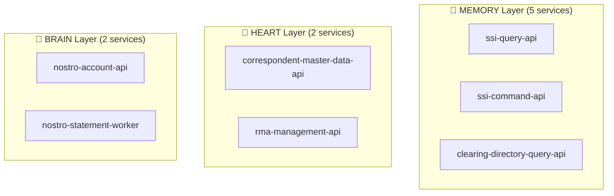
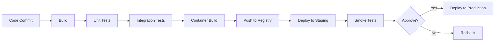

# Microservices Catalog: KRS Correspondentbanking system

**Generated:** 2025-11-26  
**Total Microservices:** 13  
**Total Bounded Contexts:** 6

---

## Table of Contents

1. [Overview](#overview)
2. [Service Map](#service-map)
3. [Services by Bounded Context](#services-by-bounded-context)
4. [Services by BIAN Trinity](#services-by-bian-trinity)
5. [Service Directory](#service-directory)
6. [Technology Stack](#technology-stack)
7. [Deployment Architecture](#deployment-architecture)
8. [Service Communication](#service-communication)
9. [Service Ownership](#service-ownership)

---

## Overview

This document catalogs all microservices in the modernized KRS Correspondentbanking system system.

### Microservices Architecture Principles

- **Domain-Driven Design:** Services aligned to bounded contexts
- **BIAN v13 Alignment:** Mapped to BIAN service domains
- **Single Responsibility:** Each service has a clear, focused purpose
- **Autonomous:** Services can be deployed independently
- **Event-Driven:** Asynchronous communication via Kafka
- **API-First:** RESTful APIs with OpenAPI specs
- **Database per Service:** No shared databases

### Service Distribution

- 💾 **MEMORY**: 5 services
- 💚 **HEART**: 2 services
- 🧠 **BRAIN**: 2 services
- ⚙️ **HYBRID**: 4 services

---

## Service Map

### By Service Type

| Type | Count | Purpose |
|------|-------|---------|
| **api-query** | 2 | Read-optimized queries |
| **api-command** | 2 | Write operations |
| **api-combined** | 3 | Other |
| **worker** | 4 | Background processing |
| **sync** | 1 | Data synchronization |
| **event-processor** | 0 | Other |
| **gateway** | 1 | API aggregation/routing |

### By Technology

| Technology | Services |
|------------|----------|
| **spring-boot** | 12 |
| **nodejs** | 1 |

### By BIAN Trinity



---

## Services by Bounded Context

### Correspondent Relationship Management

**Trinity:** HEART  
**Strategic:** CORE  
**Services:** 2

- **correspondent-master-data-api** (api-combined)
- **rma-management-api** (api-combined)

---

### Settlement Instructions Management

**Trinity:** MEMORY  
**Strategic:** CORE  
**Services:** 2

- **ssi-query-api** (api-query)
- **ssi-command-api** (api-command)

---

### Nostro Account Management

**Trinity:** BRAIN  
**Strategic:** CORE  
**Services:** 2

- **nostro-account-api** (api-combined)
- **nostro-statement-worker** (worker)

---

### Clearing System Directory

**Trinity:** MEMORY  
**Strategic:** SUPPORTING  
**Services:** 3

- **clearing-directory-query-api** (api-query)
- **clearing-directory-command-api** (api-command)
- **clearing-directory-sync-worker** (sync)

---

### Correspondent Data Gateway

**Trinity:** HYBRID  
**Strategic:** SUPPORTING  
**Services:** 2

- **correspondent-data-gateway** (gateway)
- **legacy-feed-generator-worker** (worker)

---

### Legacy Integration (Anti-Corruption Layer)

**Trinity:** HYBRID  
**Strategic:** SUPPORTING  
**Services:** 1

- **legacy-krs-acl-worker** (worker)

---

### Cross-Cutting Concern

**Trinity:** N/A  
**Strategic:** N/A  
**Services:** 1

- **audit-log-worker** (worker)

---


## Services by BIAN Trinity

### 💾 MEMORY Services (System of Record)

Read-heavy services providing reference data:

- **ssi-query-api** - Read-optimized, low-latency API for querying Standard Settlement Instructions (SSIs). Designed for h...
- **ssi-command-api** - Handles the creation, update, and validation of Standard Settlement Instructions (SSIs). Ensures dat...
- **clearing-directory-query-api** - Highly available, read-optimized API for static reference data about clearing systems (e.g., TARGET2...
- **clearing-directory-command-api** - Handles write operations for the clearing system directory. Primarily used by administrators and syn...
- **clearing-directory-sync-worker** - A scheduled worker that fetches periodic update files from clearing houses via SFTP, parses them, an...

**Characteristics:**
- Read-heavy (90%+ reads)
- Caching critical (Redis/Caffeine)
- Query performance <100ms
- Read replicas for scaling

---

### 💚 HEART Services (Lifecycle Management)

Workflow and relationship management:

- **correspondent-master-data-api** - Manages the master record for each Correspondent Bank entity, including lifecycle, validation, and a...
- **rma-management-api** - Manages SWIFT RMA (Relationship Management Application) authorizations, defining which message types...

**Characteristics:**
- ACID transactions required
- State machine workflows
- Audit trails mandatory
- Moderate read/write mix

---

### 🧠 BRAIN Services (Operations/Execution)

Transaction processing and business logic:

- **nostro-account-api** - Manages the bank's Nostro accounts held at correspondent banks. Handles master data and operational ...
- **nostro-statement-worker** - A background worker that listens for operational events and triggers actions, such as generating SWI...

**Characteristics:**
- High throughput (1000+ TPS)
- Idempotency critical
- Real-time processing
- Event-driven

---

### ⚙️ HYBRID Services (Technical/Infrastructure)

Cross-cutting technical services:

- **correspondent-data-gateway** - A unified, secure API gateway providing a facade over the domain microservices. Handles authenticati...
- **legacy-feed-generator-worker** - A scheduled batch worker that generates legacy file formats (e.g., CORR_MASTER) for backward compati...
- **legacy-krs-acl-worker** - Anti-Corruption Layer (ACL) that consumes domain events from the new microservices and performs dual...
- **audit-log-worker** - A centralized service that subscribes to all domain events and persists them into an immutable, WORM...

---

## Service Directory

### 1. Correspondent Master Data API

**Service Name:** `correspondent-master-data-api`  
**Type:** api-combined  
**Bounded Context:** Correspondent Relationship Management  
**BIAN Trinity:** HEART

**Description:** Manages the master record for each Correspondent Bank entity, including lifecycle, validation, and audit trails. Acts as the authoritative source for 'who' a correspondent is.

#### Technology Stack

- **Language:** Java 21
- **Framework:** Spring Boot 3.2
- **Database:** PostgreSQL 16 (with logical replication for audit)
- **Cache:** Redis 7 (for BIC/LEI lookups)
- **Messaging:** Kafka 3.6 (producer)
- **API Style:** REST (OpenAPI 3.1)

#### Responsibilities

- Handle CRUD operations for the CorrespondentBank aggregate.
- Validate BIC and LEI formats and checksums (NFR-006).
- Manage the lifecycle status (Active, Suspended).
- Enforce idempotent creation operations (NFR-008).
- Publish domain events for all state changes (e.g., CorrespondentCreated).


#### Owned Aggregates

- **CorrespondentBank** (BIC, LEI, NationalCentralBankLink)

#### APIs


- **Endpoints:** 6
- **Spec:** [`correspondent-master-data-api.openapi.json`](./api-specs/correspondent-master-data-api.openapi.json)


#### Database


- **Database:** `correspondent_master_db`
- **Tables:** 2
- **Migrations:** 3


#### Events

**Published:** `CorrespondentCreated`, `CorrespondentStatusChanged`

**Consumed:** None

#### Deployment

- **Replicas:** 3
- **CPU:** 500m
- **Memory:** 1Gi
- **Autoscaling:** 3-10 replicas

#### Observability


- **Metrics:** Prometheus
- **Logging:** JSON to ELK
- **Tracing:** OpenTelemetry


#### NFRs

- **Automated BIC and LEI Validation**: Integrated validation library at the API boundary.
- **Idempotent Data Creation Operations**: Use of client-provided Idempotency-Key header and backend state checking.

#### Integration Points

None

---

### 2. RMA Management API

**Service Name:** `rma-management-api`  
**Type:** api-combined  
**Bounded Context:** Correspondent Relationship Management  
**BIAN Trinity:** HEART

**Description:** Manages SWIFT RMA (Relationship Management Application) authorizations, defining which message types can be exchanged with correspondents.

#### Technology Stack

- **Language:** Java 21
- **Framework:** Spring Boot 3.2
- **Database:** PostgreSQL 16
- **Cache:** None
- **Messaging:** Kafka 3.6 (producer/consumer)
- **API Style:** REST (OpenAPI 3.1)

#### Responsibilities

- Administer SWIFT RMA permissions for sending/receiving messages.
- Process incoming RMA authorization updates from the SWIFT network.
- Provide an API to query RMA permissions for a given correspondent.
- Publish events when RMA authorizations change.


#### Owned Aggregates

- **RelationshipManagementAgreement** (AuthorizedMessage)

#### APIs


- **Endpoints:** 4
- **Spec:** [`rma-management-api.openapi.json`](./api-specs/rma-management-api.openapi.json)


#### Database


- **Database:** `rma_management_db`
- **Tables:** 3
- **Migrations:** 2


#### Events

**Published:** `RMAAuthorizationGranted`, `RMAAuthorizationRevoked`

**Consumed:** None

#### Deployment

- **Replicas:** 3
- **CPU:** 500m
- **Memory:** 512Mi
- **Autoscaling:** 2-8 replicas

#### Observability


- **Metrics:** Prometheus
- **Logging:** JSON to ELK
- **Tracing:** OpenTelemetry


#### NFRs

- **Immutable Audit Trail**: Publishes events for every state change, consumed by audit-log-worker.

#### Integration Points

- **SWIFT Gateway** (event-consumer): To receive real-time RMA updates from counterparties.

---

### 3. SSI Query API

**Service Name:** `ssi-query-api`  
**Type:** api-query  
**Bounded Context:** Settlement Instructions Management  
**BIAN Trinity:** MEMORY

**Description:** Read-optimized, low-latency API for querying Standard Settlement Instructions (SSIs). Designed for high-throughput reads from payment engines.

#### Technology Stack

- **Language:** Java 21
- **Framework:** Spring Boot 3.2
- **Database:** PostgreSQL 16 (read replicas)
- **Cache:** Redis 7
- **Messaging:** Kafka 3.6 (consumer)
- **API Style:** REST (OpenAPI 3.1)

#### Responsibilities

- Serve validated SSI data with <100ms p95 latency (NFR-005).
- Provide query capabilities to find the active SSI for a counterparty, currency, and product.
- Maintain a multi-layer cache of SSI data.
- Consume events from the command service to update the read model and cache.


#### Owned Aggregates

- **StandardSettlementInstruction** (RoutingPath, IntermediaryBank)

#### APIs


- **Endpoints:** 5
- **Spec:** [`ssi-query-api.openapi.json`](./api-specs/ssi-query-api.openapi.json)


#### Database


- **Database:** `ssi_read_db`
- **Tables:** 1
- **Migrations:** 1


#### Events

**Published:** None

**Consumed:** `SSIValidated`, `SSIRevoked`

#### Deployment

- **Replicas:** 5
- **CPU:** 500m
- **Memory:** 1Gi
- **Autoscaling:** 5-50 replicas

#### Observability


- **Metrics:** Prometheus
- **Logging:** JSON to ELK
- **Tracing:** OpenTelemetry


#### NFRs

- **Low-Latency Reference Data Retrieval**: Multi-layer caching, read replicas, and optimized query paths.
- **Horizontal Scalability of Read APIs**: Stateless design allows for horizontal scaling of replicas behind a load balancer.

#### Integration Points

- **ssi-command-api** (event-consumer): To keep the read model synchronized with the write model.

---

### 4. SSI Command API

**Service Name:** `ssi-command-api`  
**Type:** api-command  
**Bounded Context:** Settlement Instructions Management  
**BIAN Trinity:** MEMORY

**Description:** Handles the creation, update, and validation of Standard Settlement Instructions (SSIs). Ensures data integrity and business rule enforcement.

#### Technology Stack

- **Language:** Java 21
- **Framework:** Spring Boot 3.2
- **Database:** PostgreSQL 16
- **Cache:** None
- **Messaging:** Kafka 3.6 (producer)
- **API Style:** REST (OpenAPI 3.1)

#### Responsibilities

- Process Create/Update/Delete commands for SSIs.
- Validate routing chains against data from other contexts (Correspondent, Nostro, Clearing).
- Ensure integrity and validity of settlement instructions.
- Publish domain events (SSIValidated, SSIRevoked) after successful state changes.


#### Owned Aggregates

- **StandardSettlementInstruction** (RoutingPath, IntermediaryBank)

#### APIs


- **Endpoints:** 5
- **Spec:** [`ssi-command-api.openapi.json`](./api-specs/ssi-command-api.openapi.json)


#### Database


- **Database:** `ssi_write_db`
- **Tables:** 3
- **Migrations:** 2


#### Events

**Published:** `SSIValidated`, `SSIRevoked`

**Consumed:** None

#### Deployment

- **Replicas:** 3
- **CPU:** 500m
- **Memory:** 1Gi
- **Autoscaling:** 3-10 replicas

#### Observability


- **Metrics:** Prometheus
- **Logging:** JSON to ELK
- **Tracing:** OpenTelemetry


#### NFRs

- **Immutable Audit Trail**: Publishes events for every state change, consumed by audit-log-worker.
- **Support for ISO 20022 (MX) Message Data**: Database schema and DTOs include fields for structured addresses and ultimate parties.

#### Integration Points

- **correspondent-master-data-api** (api-call): To validate correspondent BICs used in SSIs.
- **nostro-account-api** (api-call): To validate nostro account details used in SSIs.
- **clearing-directory-query-api** (api-call): To validate clearing system participant data.

---

### 5. Nostro Account API

**Service Name:** `nostro-account-api`  
**Type:** api-combined  
**Bounded Context:** Nostro Account Management  
**BIAN Trinity:** BRAIN

**Description:** Manages the bank's Nostro accounts held at correspondent banks. Handles master data and operational rules.

#### Technology Stack

- **Language:** Java 21
- **Framework:** Spring Boot 3.2
- **Database:** PostgreSQL 16
- **Cache:** None
- **Messaging:** Kafka 3.6 (producer)
- **API Style:** REST (OpenAPI 3.1)

#### Responsibilities

- Maintain master data for all Nostro and Loro/Vostro accounts.
- Manage operational rules, such as statement generation thresholds.
- Provide account details to other services for validation.
- Publish events when accounts are opened, closed, or rules change.


#### Owned Aggregates

- **NostroAccount** (StatementRule)

#### APIs


- **Endpoints:** 5
- **Spec:** [`nostro-account-api.openapi.json`](./api-specs/nostro-account-api.openapi.json)


#### Database


- **Database:** `nostro_account_db`
- **Tables:** 3
- **Migrations:** 2


#### Events

**Published:** `NostroAccountOpened`, `StatementThresholdBreached`

**Consumed:** None

#### Deployment

- **Replicas:** 3
- **CPU:** 500m
- **Memory:** 512Mi
- **Autoscaling:** 2-8 replicas

#### Observability


- **Metrics:** Prometheus
- **Logging:** JSON to ELK
- **Tracing:** OpenTelemetry


#### NFRs

- **Data Encryption In-Transit and At-Rest**: TLS enforced on API and database encryption enabled.

#### Integration Points

None

---

### 6. Nostro Statement Worker

**Service Name:** `nostro-statement-worker`  
**Type:** worker  
**Bounded Context:** Nostro Account Management  
**BIAN Trinity:** BRAIN

**Description:** A background worker that listens for operational events and triggers actions, such as generating SWIFT MT210 messages.

#### Technology Stack

- **Language:** Java 21
- **Framework:** Spring Boot 3.2 (Spring Cloud Stream)
- **Database:** None
- **Cache:** None
- **Messaging:** Kafka 3.6 (consumer/producer)
- **API Style:** None

#### Responsibilities

- Consume StatementThresholdBreached events.
- Fetch necessary account details via API.
- Construct and publish a GenerateMT210 command to be consumed by the SWIFT Gateway.


#### Owned Aggregates

None

#### APIs

No API specification

#### Database


- **Database:** `N/A`
- **Tables:** 0
- **Migrations:** 0


#### Events

**Published:** `GenerateMT210`

**Consumed:** `StatementThresholdBreached`

#### Deployment

- **Replicas:** 2
- **CPU:** 250m
- **Memory:** 512Mi
- **Autoscaling:** 2-5 replicas

#### Observability


- **Metrics:** Prometheus
- **Logging:** JSON to ELK
- **Tracing:** OpenTelemetry


#### NFRs

- **Resilient Integration**: Asynchronous communication via Kafka decouples this worker from the SWIFT Gateway.

#### Integration Points

- **nostro-account-api** (api-call): To fetch full account details for statement generation.

---

### 7. Clearing Directory Query API

**Service Name:** `clearing-directory-query-api`  
**Type:** api-query  
**Bounded Context:** Clearing System Directory  
**BIAN Trinity:** MEMORY

**Description:** Highly available, read-optimized API for static reference data about clearing systems (e.g., TARGET2) and their participants.

#### Technology Stack

- **Language:** Java 21
- **Framework:** Spring Boot 3.2
- **Database:** PostgreSQL 16 (read replicas)
- **Cache:** Redis 7
- **Messaging:** Kafka 3.6 (consumer)
- **API Style:** REST (OpenAPI 3.1)

#### Responsibilities

- Serve clearing system and participant data with very low latency.
- Maintain an aggressive cache as data changes infrequently.
- Provide an API for validating participants in a given clearing system.


#### Owned Aggregates

- **ClearingSystemParticipant** (no entities)

#### APIs


- **Endpoints:** 5
- **Spec:** [`clearing-directory-query-api.openapi.json`](./api-specs/clearing-directory-query-api.openapi.json)


#### Database


- **Database:** `clearing_directory_read_db`
- **Tables:** 1
- **Migrations:** 1


#### Events

**Published:** None

**Consumed:** `ClearingDirectoryUpdated`

#### Deployment

- **Replicas:** 3
- **CPU:** 250m
- **Memory:** 512Mi
- **Autoscaling:** 3-5 replicas

#### Observability


- **Metrics:** Prometheus
- **Logging:** JSON to ELK
- **Tracing:** OpenTelemetry


#### NFRs

- **Low-Latency Reference Data Retrieval**: Aggressive in-memory caching of the entire static dataset.

#### Integration Points

None

---

### 8. Clearing Directory Command API

**Service Name:** `clearing-directory-command-api`  
**Type:** api-command  
**Bounded Context:** Clearing System Directory  
**BIAN Trinity:** MEMORY

**Description:** Handles write operations for the clearing system directory. Primarily used by administrators and sync workers.

#### Technology Stack

- **Language:** Java 21
- **Framework:** Spring Boot 3.2
- **Database:** PostgreSQL 16
- **Cache:** None
- **Messaging:** Kafka 3.6 (producer)
- **API Style:** REST (OpenAPI 3.1)

#### Responsibilities

- Provide an API for bulk updates to the participant directory.
- Ensure data integrity of incoming updates.
- Publish a single event to notify the system of a directory update.


#### Owned Aggregates

- **ClearingSystemParticipant** (no entities)

#### APIs


- **Endpoints:** 4
- **Spec:** [`clearing-directory-command-api.openapi.json`](./api-specs/clearing-directory-command-api.openapi.json)


#### Database


- **Database:** `clearing_directory_write_db`
- **Tables:** 2
- **Migrations:** 2


#### Events

**Published:** `ClearingDirectoryUpdated`

**Consumed:** None

#### Deployment

- **Replicas:** 2
- **CPU:** 250m
- **Memory:** 512Mi
- **Autoscaling:** 1-3 replicas

#### Observability


- **Metrics:** Prometheus
- **Logging:** JSON to ELK
- **Tracing:** OpenTelemetry


#### NFRs

No NFRs mapped

#### Integration Points

None

---

### 9. Clearing Directory Sync Worker

**Service Name:** `clearing-directory-sync-worker`  
**Type:** sync  
**Bounded Context:** Clearing System Directory  
**BIAN Trinity:** MEMORY

**Description:** A scheduled worker that fetches periodic update files from clearing houses via SFTP, parses them, and calls the command API to update the directory.

#### Technology Stack

- **Language:** Java 21
- **Framework:** Spring Boot 3.2 (Scheduled Tasks)
- **Database:** None
- **Cache:** None
- **Messaging:** None
- **API Style:** None

#### Responsibilities

- On a schedule, connect to external SFTP servers.
- Download new or updated participant directory files.
- Parse the files and transform data into the canonical model.
- Call the command API to perform a bulk update.


#### Owned Aggregates

None

#### APIs

No API specification

#### Database


- **Database:** `N/A`
- **Tables:** 0
- **Migrations:** 0


#### Events

**Published:** None

**Consumed:** None

#### Deployment

- **Replicas:** 1
- **CPU:** 250m
- **Memory:** 512Mi
- **Autoscaling:** 1-1 replicas

#### Observability


- **Metrics:** Prometheus
- **Logging:** JSON to ELK
- **Tracing:** OpenTelemetry


#### NFRs

No NFRs mapped

#### Integration Points

- **clearing-directory-command-api** (api-call): To push the updated data into the system.

---

### 10. Correspondent Data Gateway

**Service Name:** `correspondent-data-gateway`  
**Type:** gateway  
**Bounded Context:** Correspondent Data Gateway  
**BIAN Trinity:** HYBRID

**Description:** A unified, secure API gateway providing a facade over the domain microservices. Handles authentication, routing, and rate limiting for external consumers.

#### Technology Stack

- **Language:** Node.js 20
- **Framework:** Fastify
- **Database:** None
- **Cache:** Redis 7 (for rate limiting)
- **Messaging:** None
- **API Style:** REST (OpenAPI 3.1)

#### Responsibilities

- Expose a single, unified API endpoint for all correspondent data.
- Authenticate and authorize all incoming requests (NFR-002).
- Route requests to the appropriate downstream microservices.
- Aggregate data from multiple services if required by a consumer.
- Provide comprehensive observability (logging, tracing, metrics) for all traffic.


#### Owned Aggregates

None

#### APIs


- **Endpoints:** 3
- **Spec:** [`correspondent-data-gateway.openapi.json`](./api-specs/correspondent-data-gateway.openapi.json)


#### Database


- **Database:** `N/A`
- **Tables:** 0
- **Migrations:** 0


#### Events

**Published:** None

**Consumed:** None

#### Deployment

- **Replicas:** 4
- **CPU:** 500m
- **Memory:** 512Mi
- **Autoscaling:** 4-20 replicas

#### Observability


- **Metrics:** Prometheus
- **Logging:** JSON to ELK
- **Tracing:** OpenTelemetry


#### NFRs

- **High Availability for Core Services**: Stateless design deployed in a multi-AZ configuration with auto-scaling.
- **Zero-Downtime Deployments**: Deployed via Kubernetes using a blue-green or canary release strategy.

#### Integration Points

- **All domain APIs** (api-call): To route incoming requests to the correct backend service.

---

### 11. Legacy Feed Generator Worker

**Service Name:** `legacy-feed-generator-worker`  
**Type:** worker  
**Bounded Context:** Correspondent Data Gateway  
**BIAN Trinity:** HYBRID

**Description:** A scheduled batch worker that generates legacy file formats (e.g., CORR_MASTER) for backward compatibility with systems like Treasury.

#### Technology Stack

- **Language:** Java 21
- **Framework:** Spring Batch
- **Database:** None
- **Cache:** None
- **Messaging:** None
- **API Style:** None

#### Responsibilities

- Run on a schedule (e.g., end-of-day) to generate batch files.
- Fetch data from various query APIs to build the file content.
- Format the data into the exact legacy schema.
- Upload the generated file to a designated SFTP location.


#### Owned Aggregates

None

#### APIs

No API specification

#### Database


- **Database:** `N/A`
- **Tables:** 0
- **Migrations:** 0


#### Events

**Published:** None

**Consumed:** None

#### Deployment

- **Replicas:** 1
- **CPU:** 1
- **Memory:** 2Gi
- **Autoscaling:** 1-1 replicas

#### Observability


- **Metrics:** Prometheus
- **Logging:** JSON to ELK
- **Tracing:** OpenTelemetry


#### NFRs

- **Backward Compatibility for Legacy Consumers**: Dedicated service whose sole purpose is to generate schema-identical legacy files.
- **Batch Processing Window Adherence**: Uses Spring Batch for optimized, parallelizable batch processing.

#### Integration Points

- **ssi-query-api** (api-call): To fetch all SSI data for the daily feed.
- **correspondent-master-data-api** (api-call): To fetch all correspondent data for the daily feed.

---

### 12. Legacy KRS ACL Worker

**Service Name:** `legacy-krs-acl-worker`  
**Type:** worker  
**Bounded Context:** Legacy Integration (Anti-Corruption Layer)  
**BIAN Trinity:** HYBRID

**Description:** Anti-Corruption Layer (ACL) that consumes domain events from the new microservices and performs dual-writes to the legacy KRS database during migration.

#### Technology Stack

- **Language:** Java 21
- **Framework:** Spring Boot 3.2 (Spring Cloud Stream)
- **Database:** Oracle DB Connector
- **Cache:** None
- **Messaging:** Kafka 3.6 (consumer)
- **API Style:** None

#### Responsibilities

- Consume all CUD domain events from the modernized services.
- Translate the event payload from the new canonical model to the legacy KRS table structure.
- Perform idempotent INSERT/UPDATE/DELETE operations on the legacy database.
- Monitor and alert on data synchronization lag and errors.


#### Owned Aggregates

None

#### APIs

No API specification

#### Database


- **Database:** `N/A (Oracle)`
- **Tables:** 0
- **Migrations:** 0


#### Events

**Published:** None

**Consumed:** `CorrespondentCreated`, `SSIValidated`

#### Deployment

- **Replicas:** 2
- **CPU:** 500m
- **Memory:** 1Gi
- **Autoscaling:** 2-5 replicas

#### Observability


- **Metrics:** Prometheus
- **Logging:** JSON to ELK
- **Tracing:** OpenTelemetry


#### NFRs

- **Data Migration Validation and Rollback**: This service is the core component of the Strangler Fig migration, enabling parallel runs and verification.

#### Integration Points

- **Legacy KRS Database** (database-write): To keep the legacy system synchronized during migration.

---

### 13. Audit Log Worker

**Service Name:** `audit-log-worker`  
**Type:** worker  
**Bounded Context:** Cross-Cutting Concern  
**BIAN Trinity:** HYBRID

**Description:** A centralized service that subscribes to all domain events and persists them into an immutable, WORM-compliant audit log for compliance and regulatory purposes.

#### Technology Stack

- **Language:** Java 21
- **Framework:** Spring Boot 3.2 (Spring Cloud Stream)
- **Database:** AWS S3 (with Object Lock)
- **Cache:** None
- **Messaging:** Kafka 3.6 (consumer)
- **API Style:** None

#### Responsibilities

- Consume events from all domain topics.
- Store each event as a separate, immutable object in a secure storage bucket.
- Ensure compliance with data retention policies (NFR-003).
- Provide a mechanism for authorized users to query the audit log (e.g., via Athena).


#### Owned Aggregates

None

#### APIs

No API specification

#### Database


- **Database:** `N/A (AWS S3)`
- **Tables:** 0
- **Migrations:** 0


#### Events

**Published:** None

**Consumed:** `CorrespondentCreated`, `CorrespondentStatusChanged`, `RMAAuthorizationGranted`, `RMAAuthorizationRevoked`, `SSIValidated`, `SSIRevoked`, `NostroAccountOpened`, `ClearingDirectoryUpdated`

#### Deployment

- **Replicas:** 2
- **CPU:** 250m
- **Memory:** 512Mi
- **Autoscaling:** 2-5 replicas

#### Observability


- **Metrics:** Prometheus
- **Logging:** JSON to ELK
- **Tracing:** OpenTelemetry


#### NFRs

- **Immutable Audit Trail for Compliance**: This service is the primary implementation of this NFR, using WORM storage.
- **Regulatory Data Retention**: Configures S3 lifecycle policies to archive logs to Glacier for 10+ years.

#### Integration Points

- **AWS S3** (storage-write): To store the immutable audit log.

---


## Technology Stack

### Languages & Frameworks


**Databases:**
- PostgreSQL
- None
- Oracle
- AWS

**Caches:**
- Redis
- None

**Messaging:**
- Kafka
- None

**Frameworks:**
- Spring
- Fastify


### Common Libraries

- **Logging:** Logback / SLF4J (Java), Winston (Node.js)
- **Monitoring:** Micrometer + Prometheus
- **Tracing:** OpenTelemetry + Jaeger
- **Testing:** JUnit 5 + Testcontainers (Java), Jest (Node.js)
- **API Docs:** Springdoc OpenAPI (Java), Swagger (Node.js)
- **Config:** Spring Cloud Config / Environment Variables
- **Security:** Spring Security / Passport.js

---

## Deployment Architecture

### Total Resources


- **Total Replicas:** 35
- **Total CPU:** 6.5
- **Total Memory:** 9.5Gi
- **Required Nodes:** undefined x undefined
- **Estimated Cost:** $550 (AWS EKS with 4x m5.large nodes)


### Kubernetes Configuration

**Namespace:** `krs-correspondentbanking-system`

**Resource Quotas:**
```yaml
apiVersion: v1
kind: ResourceQuota
metadata:
  name: service-quotas
spec:
  hard:
    requests.cpu: "6.5"
    requests.memory: "9.5Gi"
    persistentvolumeclaims: "10"
```

### High Availability

- **Replication:** All services run with ≥ 2 replicas
- **Pod Disruption Budget:** Max 1 unavailable pod per service
- **Anti-affinity:** Pods spread across availability zones
- **Health Checks:** Liveness + readiness probes on all services
- **Rolling Updates:** Zero-downtime deployments

---

## Service Communication

### Synchronous (REST APIs)

Services communicate via REST APIs for:
- Real-time queries (e.g., "Get correspondent details")
- Commands requiring immediate response
- Request/response patterns

**Pattern:**
```
Client → API Gateway → Service A → Service B
                           ↓
                        Database
```

### Asynchronous (Events)

Services communicate via Kafka events for:
- Domain events (state changes)
- Integration events (cross-context notifications)
- Background processing
- Data synchronization

**Pattern:**
```
Service A → Kafka Topic → Service B
              ↓              ↓
         Event Store    Read Model
```

### Communication Matrix

| From Service | To Service | Style | Via |
|--------------|------------|-------|-----|
| rma-management-api | SWIFT Gateway | Async | Kafka |
| ssi-query-api | ssi-command-api | Async | Kafka |
| ssi-command-api | correspondent-master-data-api | Sync | REST |
| ssi-command-api | nostro-account-api | Sync | REST |
| ssi-command-api | clearing-directory-query-api | Sync | REST |
| nostro-statement-worker | nostro-account-api | Sync | REST |
| clearing-directory-sync-worker | clearing-directory-command-api | Sync | REST |
| correspondent-data-gateway | All domain APIs | Sync | REST |

---

## Service Ownership

### Team Structure (Recommended)

**Squad Model:** 2-pizza teams (6-8 people per squad)

#### Correspondent Relationship Management Squad

**Services:** 2  
**Team Size:** 6 people

**Roles:**
- 1 Tech Lead / Architect
- 3 Backend Developers
- 1 DevOps Engineer
- 1 QA Engineer
- 0.5 Product Owner (shared)

**Responsibilities:**
- correspondent-master-data-api
- rma-management-api


---

#### Settlement Instructions Management Squad

**Services:** 2  
**Team Size:** 6 people

**Roles:**
- 1 Tech Lead / Architect
- 3 Backend Developers
- 1 DevOps Engineer
- 1 QA Engineer
- 0.5 Product Owner (shared)

**Responsibilities:**
- ssi-query-api
- ssi-command-api


---

#### Nostro Account Management Squad

**Services:** 2  
**Team Size:** 6 people

**Roles:**
- 1 Tech Lead / Architect
- 3 Backend Developers
- 1 DevOps Engineer
- 1 QA Engineer
- 0.5 Product Owner (shared)

**Responsibilities:**
- nostro-account-api
- nostro-statement-worker


---

#### Clearing System Directory Squad

**Services:** 3  
**Team Size:** 6 people

**Roles:**
- 1 Tech Lead / Architect
- 5 Backend Developers
- 1 DevOps Engineer
- 1 QA Engineer
- 0.5 Product Owner (shared)

**Responsibilities:**
- clearing-directory-query-api
- clearing-directory-command-api
- clearing-directory-sync-worker


---

#### Correspondent Data Gateway Squad

**Services:** 2  
**Team Size:** 6 people

**Roles:**
- 1 Tech Lead / Architect
- 3 Backend Developers
- 1 DevOps Engineer
- 1 QA Engineer
- 0.5 Product Owner (shared)

**Responsibilities:**
- correspondent-data-gateway
- legacy-feed-generator-worker


---


### Service Ownership Matrix

| Service | Squad | On-Call | Runbook |
|---------|-------|---------|---------|
| correspondent-master-data-api | correspondent-relationship-management-squad | correspondent-relationship-management-oncall | [Link](./runbooks/correspondent-master-data-api.md) |
| rma-management-api | correspondent-relationship-management-squad | correspondent-relationship-management-oncall | [Link](./runbooks/rma-management-api.md) |
| ssi-query-api | settlement-instructions-management-squad | settlement-instructions-management-oncall | [Link](./runbooks/ssi-query-api.md) |
| ssi-command-api | settlement-instructions-management-squad | settlement-instructions-management-oncall | [Link](./runbooks/ssi-command-api.md) |
| nostro-account-api | nostro-account-management-squad | nostro-account-management-oncall | [Link](./runbooks/nostro-account-api.md) |
| nostro-statement-worker | nostro-account-management-squad | nostro-account-management-oncall | [Link](./runbooks/nostro-statement-worker.md) |
| clearing-directory-query-api | clearing-system-directory-squad | clearing-system-directory-oncall | [Link](./runbooks/clearing-directory-query-api.md) |
| clearing-directory-command-api | clearing-system-directory-squad | clearing-system-directory-oncall | [Link](./runbooks/clearing-directory-command-api.md) |
| clearing-directory-sync-worker | clearing-system-directory-squad | clearing-system-directory-oncall | [Link](./runbooks/clearing-directory-sync-worker.md) |
| correspondent-data-gateway | correspondent-data-gateway-squad | correspondent-data-gateway-oncall | [Link](./runbooks/correspondent-data-gateway.md) |

---

## Service Lifecycle

### Development

1. **Design:** API spec + DB schema + event schemas
2. **Implement:** Code + tests + documentation
3. **Review:** Code review + architecture review
4. **Test:** Unit + integration + contract tests
5. **Deploy:** CI/CD pipeline to staging

### Deployment Pipeline



### Monitoring

Each service exposes:
- **Metrics:** Prometheus endpoint at `/actuator/prometheus`
- **Health:** `/actuator/health`, `/actuator/health/liveness`, `/actuator/health/readiness`
- **Info:** `/actuator/info` (version, build info)

**Dashboards:**
- Service-level: Request rate, latency, errors
- Infrastructure: CPU, memory, network
- Business: Transactions processed, revenue

---

## Service Discovery

### Kubernetes Service Discovery

Services discover each other via Kubernetes DNS:

```
http://{service-name}.{namespace}.svc.cluster.local:{port}
```

**Example:**
```
http://correspondent-directory-query-api.banking.svc.cluster.local:8080
```

### External Access

**API Gateway:** Kong / AWS API Gateway

```
https://api.example.com/v1/correspondents → correspondent-directory-query-api
https://api.example.com/v1/relationships → correspondent-relationship-api
```

---

## Next Steps

1. **Review Services:** Understand each service's purpose
2. **Set Up Infrastructure:** Kubernetes, Kafka, databases
3. **Deploy Services:** Use CI/CD pipelines
4. **Configure Monitoring:** Prometheus + Grafana dashboards
5. **Assign Teams:** Map services to squads
6. **Begin Development:** Start with Memory services (reference data)

---

## Support

For microservices questions:
- **Service Specs:** See `microservices/` folder for complete specs
- **API Docs:** See `API_CATALOG.md`
- **DB Docs:** See `DATABASE_CATALOG.md`
- **Event Docs:** See `EVENT_CATALOG.md`
- **Contact:** architecture@yourbank.com

---

*This microservices catalog was auto-generated from the Legacy System Modernization Pipeline.*
